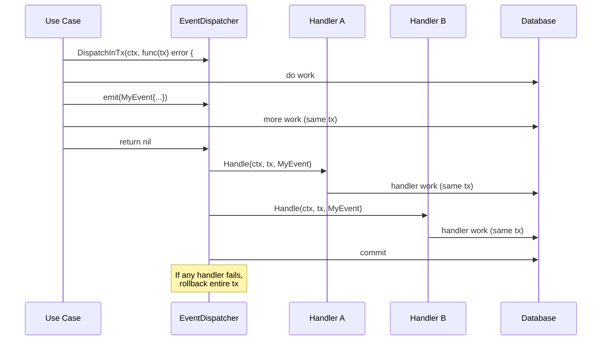
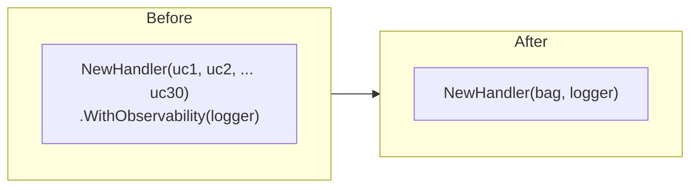

# P2 Architecture Patterns — Domain Events, Constructor Injection, Handler Simplification

## Summary

Migrate three P2 architecture patterns from the improvement report: introduce a lightweight transactional domain-event system for cross-aggregate operations, replace the `WithObservability` struct-copy pattern with constructor injection across all handlers, and simplify the children handler's 30-parameter constructor with use-case bag structs.

## Problem Frame

The codebase has three accumulated architecture debts that hinder adding new behavior:

1. **No domain events.** Cross-aggregate side effects (child deactivation cascading from term expiry, invoice lifecycle notifications) are wired as synchronous adapter calls through `bootstrap.go`. Adding a new side effect requires modifying the originating use case and re-wiring the new dependency through the full bootstrap chain.

2. **`WithObservability` pattern fragility.** Every handler constructs its full struct without a logger, then calls `.WithObservability(logger)` to create a copy with the logger set. This creates two code paths per handler (with and without logger), makes forgetting the call a silent no-op, and bloats each handler file with a 20–50 line struct-copy method.

3. **Handler constructor explosion.** The children handler `NewHandler` takes 30+ discrete use-case parameters. Adding a new sub-resource (e.g., a new child sub-entity) requires changing the constructor signature, the struct literal, the bag struct copy in `WithObservability`, and every call site.

---

## Requirements

- R1. Domain events follow a common interface and carry typed payloads with an occurrence timestamp.
- R2. Event handlers are registered externally (in bootstrap) and dispatched within the same transaction that produced the event.
- R3. Adding a new handler for an existing event does not require modifying the originating use case.
- R4. All handler constructors accept `*slog.Logger` directly. The `WithObservability` method is removed from every handler.
- R5. Use cases that use `WithObservability(logger, recorder)` accept logger and recorder at construction time, with a nil-safe recorder default.
- R6. The children handler constructor accepts a single `ChildrenUseCases` bag struct instead of 30+ individual parameters.
- R7. Other handlers with 8+ constructor parameters may use the same bag struct pattern where it improves maintainability.

---

## Key Technical Decisions

- **KTD-1: In-process event dispatcher, no message broker.** Events are dispatched synchronously within the calling goroutine, using the existing `transaction.Manager` to ensure handlers execute inside the same database transaction. A message broker (SQS, RabbitMQ) can be introduced later when cross-process handlers are needed, but the current workload is single-process.
- **KTD-2: Event dispatcher wraps transaction.Manager.** Rather than threading events through the use case's existing tx callback, the dispatcher provides a `DispatchInTx` method that collects events during `fn(tx)` execution and dispatches handlers before the transaction commits.
- **KTD-3: `mapstructure` — handler constructors carry logger at construction, not as a separate call.** This is a mechanical but wide-reaching change: every handler's `NewHandler` gains a `logger *slog.Logger` parameter, and the `WithObservability` method is deleted. The bootstrap site passes logger directly. This eliminates the silent-no-op failure mode and the struct-copy boilerplate.
- **KTD-4: Children handler bag struct uses the same package as the handler.** A `ChildrenUseCases` struct lives in `interfaces/http/` alongside the handler, avoiding a new package and keeping the change localized.
- **KTD-5: Apply bag struct to other handlers only when it meaningfully improves the constructor signature.** Handlers with 3–5 parameters (absence, attendance, funding) do not benefit — the ceremony of a bag struct outweighs the simplification. The term handler (9 params) and billing handler (10 params) are candidates.

---

## High-Level Technical Design

### Domain event flow



### Handler construction after migration



---

## Scope Boundaries

- **In scope:** Domain event infrastructure and two event types (child deactivation, billing lifecycle). Constructor-inject logger for all 10 HTTP handlers. Bag struct for children handler. Candidate bag struct evaluation for term and billing handlers.
- **Deferred to Follow-Up Work:** Emitting `TermExpired` from the term module's `ExpireTermsUseCase` — the term module first needs its event footprint well-understood, and the child deactivation cascade already works via `WithDeactivator`. Events for additional domains (attendance, funding) are future work.
- **Outside this plan's identity:** Event persistence (event sourcing or outbox table), async message broker, CQRS read models. None of these are warranted at the current scale.

---

## Implementation Units

### U1. Domain event infrastructure

- **Goal:** Define the shared domain event interface, concrete event types, the event dispatcher, and handler interfaces.
- **Requirements:** R1, R2
- **Dependencies:** None
- **Files:**
  - Create: `api/internal/platform/events/dispatcher.go`
  - Create: `api/internal/platform/events/dispatcher_test.go`
- **Approach:**
  - Define `type DomainEvent interface { OccurredAt() time.Time }` in `platform/events`.
  - Define `type Handler[T DomainEvent] interface { Handle(ctx context.Context, tx pgx.Tx, event T) error }` — generic over event type.
  - `EventDispatcher` wraps `*transaction.Manager` and exposes `DispatchInTx(ctx, func(emitter Emitter) error) error`. The `Emitter` (an interface with `Emit(event)`) collects events during `fn`. After `fn` returns nil, the dispatcher looks up registered handlers for each event type and calls them in registration order, passing the same `tx`. If any handler fails, the transaction rolls back.
  - Registration: `dispatcher.Register(eventType, handler)` in bootstrap.
  - Package choice: `platform/events` keeps event infrastructure alongside `platform/transaction`. No domain imports leak in.
- **Patterns to follow:** The existing `transaction.Manager` pattern — wrapping a function callback with begin/commit/rollback.
- **Test scenarios:**
  - Emitting an event during a transaction dispatches its handler within the same transaction.
  - Emitting an event when no handler is registered is a no-op (not an error).
  - A handler failure rolls back the transaction and the main work.
  - Multiple handlers for the same event type all execute in registration order.
  - Handlers receive the correct committed data (integration, with a real DB).
- **Verification:** Unit tests cover dispatcher mechanics with mock handlers. One integration test confirms transactional rollback on handler failure.

### U2. ChildDeactivated event and handler

- **Goal:** Emit `ChildDeactivated` when `MarkInactive.Execute` completes, and route the event to a no-op handler initially (ready for future side effects).
- **Requirements:** R3
- **Dependencies:** U1
- **Files:**
  - Create: `api/internal/modules/children/domain/events.go`
  - Modify: `api/internal/modules/children/application/mark_inactive.go`
  - Modify: `api/internal/app/bootstrap/adapters.go` (register handler wiring)
  - Modify: `api/internal/app/bootstrap/bootstrap.go` (wire dispatcher)
- **Approach:**
  - Define `ChildDeactivated` event in `children/domain/events.go`:
    ```go
    type ChildDeactivated struct {
        ChildID    uuid.UUID
        ReasonCode string
        Occurred   time.Time
    }
    func (e ChildDeactivated) OccurredAt() time.Time { return e.Occurred }
    ```
  - `MarkInactive` gains a `dispatcher *events.EventDispatcher` parameter. After the existing tx work completes successfully, the dispatcher emits the event (handlers run before commit per U1's design). The calling code in `Execute` is unchanged except for the emit call.
  - Bootstrap wires the dispatcher and registers a no-op handler initially.
- **Patterns to follow:** The IMPROVEMENTS.md suggested interface — `type ChildDeactivatedHandler interface { Handle(ctx context.Context, event ChildDeactivated) error }`.
- **Test scenarios:**
  - Calling `MarkInactive.Execute` with valid input emits a `ChildDeactivated` event with the correct ChildID and ReasonCode.
  - The event is emitted within the same transaction (rollback in the handler rolls back the deactivation).
  - Creating a handler that performs additional work (e.g., closing associated records) executes alongside the deactivation.
- **Verification:** Unit test on `MarkInactive` verifying event emission. Integration test verifying transactional boundary.

### U3. Billing invoice lifecycle events

- **Goal:** Emit `InvoiceIssued` when `IssueInvoice` runs and `InvoiceMarkedOverdue` when `MarkOverdueInvoices` runs. Wire the dispatcher but register no handlers yet (events are recorded for future use).
- **Requirements:** R3
- **Dependencies:** U1
- **Files:**
  - Create: `api/internal/modules/billing/domain/events.go`
  - Modify: `api/internal/modules/billing/application/issue_invoices.go`
  - Modify: `api/internal/modules/billing/application/mark_overdue_invoices.go`
  - Modify: `api/internal/app/bootstrap/bootstrap.go` (register handlers)
- **Approach:**
  - Define `InvoiceIssued` and `InvoiceMarkedOverdue` in `billing/domain/events.go`.
  - `IssueInvoice` and `MarkOverdueInvoices` gain a `dispatcher *events.EventDispatcher` parameter. Each emits its event after the core work completes successfully within the tx.
  - Bootstrap registers no-op handlers initially.
  - Dispatcher and event types follow the same pattern as U2.
- **Patterns to follow:** U2 — identical wiring pattern.
- **Test scenarios:**
  - `IssueInvoice` emits `InvoiceIssued` with the correct invoice ID and timestamp.
  - `MarkOverdueInvoices` emits `InvoiceMarkedOverdue` for each invoice that transitions to overdue.
  - Events are transactional — handler failure rolls back the issue/mark-overdue operation.
- **Verification:** Unit tests on both use cases verifying event emission. Integration test on transactional boundary.

### U4. Migrate handlers to constructor-injected logger

- **Goal:** All HTTP handlers accept `*slog.Logger` at construction time. `WithObservability` methods are deleted. `GenerateDraftInvoicesUseCase` also accepts logger and optional recorder at construction.
- **Requirements:** R4, R5
- **Dependencies:** None
- **Files:**
  - Modify: `api/internal/modules/children/interfaces/http/handler.go`
  - Modify: `api/internal/modules/term/interfaces/http/handler.go`
  - Modify: `api/internal/modules/billing/interfaces/http/handler.go`
  - Modify: `api/internal/modules/attendance/interfaces/http/handler.go`
  - Modify: `api/internal/modules/absence/interfaces/http/handler.go`
  - Modify: `api/internal/modules/funding/interfaces/http/handler.go`
  - Modify: `api/internal/modules/rooms/interfaces/http/handler.go`
  - Modify: `api/internal/modules/sessiontypes/interfaces/http/handler.go`
  - Modify: `api/internal/modules/sessiontemplates/interfaces/http/handler.go`
  - Modify: `api/internal/modules/invites/interfaces/http/handler.go`
  - Modify: `api/internal/modules/parentchildmappings/interfaces/http/handler.go`
  - Modify: `api/internal/modules/authentication/interfaces/http/handler.go`
  - Modify: `api/internal/modules/passwordreset/interfaces/http/handler.go`
  - Modify: `api/internal/modules/payments/interfaces/http/handler.go`
  - Modify: `api/internal/modules/owner/interfaces/http/handler.go`
  - Modify: `api/internal/modules/billing/application/generate_draft_invoices.go`
  - Modify: `api/internal/app/bootstrap/bootstrap.go`
  - Tests for each modified handler file.
- **Approach:**
  - For each handler, add `logger *slog.Logger` as the first or last parameter of `NewHandler`. Update the struct literal to store it. Delete `WithObservability`.
  - For `GenerateDraftInvoicesUseCase`, add `logger *slog.Logger` and `recorder *metrics.Recorder` parameters. If recorder is nil, use `metrics.NopRecorder` internally.
  - For handlers that also receive `recorder` in their `WithObservability` (payments, owner billing setup), add it as an optional nil-safe parameter.
  - In `bootstrap.go`, remove all `.WithObservability(logger)` calls. Pass logger (and recorder where applicable) directly to `NewHandler(...)`.
  - The auth handler currently calls `.WithObservability(logger, recorder)` — recorder moves to constructor.
  - Builds on the P0 `WithObservability` migration pattern established in `docs/solutions/architecture-patterns/clean-architecture-dependency-rule.md`.
- **Patterns to follow:** Existing handler struct layout (logger field already present in most handlers).
- **Test scenarios:**
  - Each handler handles errors with the injected logger (existing behavior, preserved).
  - Handlers with nil recorder use NopRecorder without panicking.
  - Handler responses are unchanged by the migration (characterization tests can confirm).
  - Handler tests compile and pass with the new constructor signature.
- **Execution note:** Run handler tests after each group of changes to catch wiring errors early. Group by module for incremental verifying.
- **Verification:** All handler tests pass. `go build ./...` and `go vet ./...` pass. A grep for `.WithObservability(` in handler files returns zero results (bootstrap may still have `.WithObservability` on non-handler use cases — those need separate evaluation).

### U5. Bag struct for children handler constructor

- **Goal:** Replace `NewHandler(30+ parameters)` with `NewHandler(cfg ChildrenHandlerConfig, logger *slog.Logger)` where `ChildrenHandlerConfig` is a bag struct grouping use cases by sub-resource domain.
- **Requirements:** R6
- **Dependencies:** U4 (the logger parameter is already being added)
- **Files:**
  - Modify: `api/internal/modules/children/interfaces/http/handler.go`
  - Modify: `api/internal/app/bootstrap/bootstrap.go`
- **Approach:**
  - Define a `ChildrenHandlerConfig` struct in the handler package:
    ```go
    type ChildrenHandlerConfig struct {
        Core      CoreUseCases
        Profile   ProfileUseCases
        Contacts  ContactsUseCases
        Health    HealthUseCases
        // ... remaining sub-resource groups
    }

    type CoreUseCases struct {
        List   *application.ListChildren
        Get    *application.GetChild
        Create *application.CreateChildWithFullProfile
        Update *application.UpdateChild
        MarkInactive *application.MarkInactive
    }
    ```
  - Group use cases by sub-resource domain (matching the existing comment groupings in the handler struct).
  - `NewHandler(cfg ChildrenHandlerConfig, logger *slog.Logger) *Handler` — body assigns from `cfg` subgroups.
  - In `bootstrap.go`, construct the `ChildrenHandlerConfig` and pass it.
  - Adding a new sub-resource later only requires adding a new field to the config struct and populating it in bootstrap — the handler constructor signature does not change.
- **Patterns to follow:** The file's existing sub-resource comment groupings (`// --- Sub-resource handlers ---`).
- **Test scenarios:**
  - Handler behavior is unchanged by the constructor change (characterization).
  - All handler methods (30+ handlers covering core, profile, contacts, etc.) execute the correct use case from the bag.
- **Verification:** All children handler tests pass. `go build ./...` passes. New sub-resources can be added by extending the config struct without changing the constructor signature.

### U6. Bag struct for term and billing handlers (candidate)

- **Goal:** Apply the bag struct pattern to the term handler (9 params) and billing handler (10 params) where it meaningfully reduces constructor churn.
- **Requirements:** R7
- **Dependencies:** U4 (logger already being moved to constructor)
- **Files:**
  - Modify: `api/internal/modules/term/interfaces/http/handler.go` (if adopted)
  - Modify: `api/internal/modules/billing/interfaces/http/handler.go` (if adopted)
  - Modify: `api/internal/app/bootstrap/bootstrap.go`
- **Approach:**
  - Evaluate each handler: if the constructor has 8+ parameters that naturally group (term: core term ops + schedule change ops; billing: draft generation + invoice management + parent views), introduce a bag struct.
  - For the term handler: `TermHandlerConfig{ Core: CoreTermUCs, Changes: ScheduleChangeUCs }`
  - For the billing handler: `BillingHandlerConfig{ Drafting: DraftUCs, Lifecycle: LifecycleUCs, Parent: ParentUCs, Admin: AdminUCs }`
  - If the grouping does not improve clarity (e.g., all parameters are already well-named and small in number), skip the handler.
- **Patterns to follow:** U5's `ChildrenHandlerConfig` pattern.
- **Test scenarios:**
  - Handler constructor equivalency — old and new constructors produce identical handlers.
  - All handler tests pass after the constructor change.
- **Verification:** All affected handler tests pass. `go build ./...` passes. Unchanged handlers have no compilation errors.

---

## Risks & Dependencies

- **Risk: Event dispatcher design adds complexity to simple use cases.** The dispatcher is opt-in: only use cases that need it receive it. Most use cases remain unchanged.
- **Risk: Constructor migration touches 15 handler files + bootstrap.go.** The change is mechanical but broad. Group by module and run `go build` after each module to localize issues.
- **Risk: Bag struct pattern adds indirection.** The indirection is justified for 30-parameter constructors but not for small handlers. U6 evaluates each case individually. If the term or billing handler does not materially benefit, it is skipped.
- **Dependency: U5 and U6 depend on U4** (logger constructor migration) because both change the same constructor signatures. U5 and U6 should be implemented after U4 merges.

---

## Sequence

```
U1 (event infra) → U2 (ChildDeactivated) + U3 (billing events) — independent of U4/5/6
U4 (constructor inject logger) → U5 (children bag) + U6 (term/billing bag candidates)
```

U1–U3 and U4 can run in parallel as they touch disjoint files. U5/U6 must follow U4. U2 and U3 can run in parallel.

---

## Open Questions

- **Q1: Should the event dispatcher handle registration at bootstrap or inside the use case?** Bootstrap registration is preferred (KTD-1) — the use case declares events, bootstrap wires handlers. This keeps use cases free of handler awareness.
- **Q2: Should the term module emit TermExpired now or defer to follow-up?** Deferred — the child deactivation cascade already works. When the term module needs additional side effects, the event infrastructure will be ready. (Resolved as "deferred" — see Scope Boundaries.)
- **Q3: Should the dispatcher expose a standalone `Emit(ctx, event)` for non-transactional use cases?** Not yet — all current event sources operate within a transaction. A non-tx variant can be added when needed.

---

## Sources & Research

- `docs/reports/IMPROVEMENTS.md` — Items 7, 8, 9 (origin of all three patterns).
- `docs/solutions/architecture-patterns/clean-architecture-dependency-rule.md` — Prior P0 migration pattern for dependency injection.
- `api/internal/modules/children/interfaces/http/handler.go` — Current 30-parameter handler constructor and `WithObservability`.
- `api/internal/app/bootstrap/bootstrap.go` — All handler wiring sites and `WithDeactivator` usage.
- `api/internal/modules/term/application/status_transitions.go:141` — `WithDeactivator` pattern that events would replace for future side effects.
- `api/internal/platform/transaction/manager.go` — Existing transaction manager that the event dispatcher wraps.
- `api/internal/modules/billing/domain/money.go` — Existing value object as precedent for domain type patterns.
