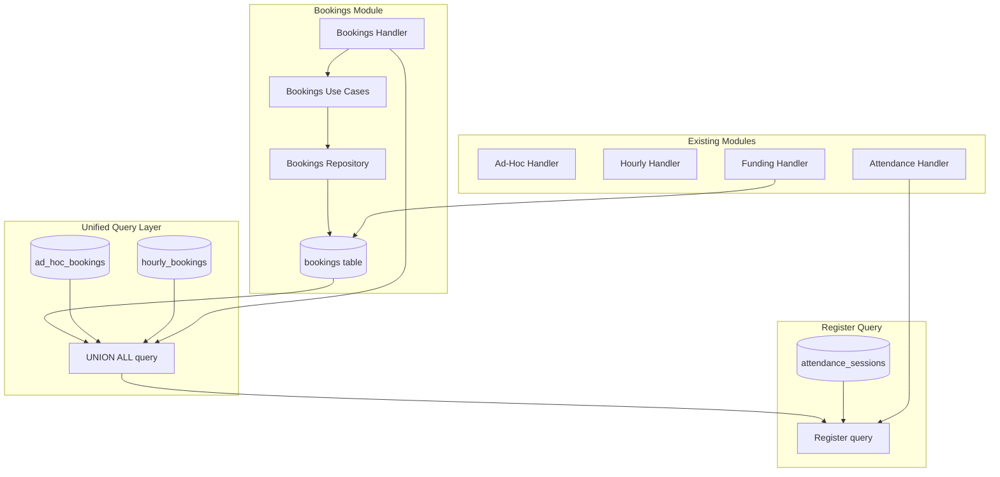

## Goal Capsule

- **Objective:** Implement 18 new API endpoints and enhance 3 existing ones to support the Booking, Sessions & Funding UX flow across 5 areas: unified bookings, attendance register, funding, billing, and parent portal.
- **Authority hierarchy:** API gap analysis (`docs/api/API-GAP-ANALYSIS-BOOKING-SESSIONS-FUNDING.md`) + UX spec (`docs/ux/BOOKING-SESSIONS-FUNDING-FLOW.md`).
- **Stop conditions:** All endpoints return correct responses per UX spec; existing billing/ad-hoc/hourly booking integrations remain unbroken.
- **Execution profile:** Standard code implementation following existing Clean Architecture patterns.
- **Tail ownership:** Backend API endpoints only. Frontend Angular components/routes are out of scope (separate plan).

## Product Contract

### Summary

The nursery management system currently has fragmented booking types (ad-hoc, hourly, recurring booking patterns) with no unified view. The UX spec requires a single bookings module that unifies all booking types, an attendance register that pre-populates from bookings, enhanced funding metrics, and 7 new parent portal endpoints. This plan implements the backend API layer for all of these.

### Problem Frame

- No unified booking list/calendar — managers must navigate 3 separate pages
- No daily register endpoint that merges bookings with attendance status
- Funding overview lacks utilization metrics and expiring-soon alerts
- Parent portal has no booking, attendance, or funding self-service endpoints
- Billing needs verification that funded deduction line items work correctly

### Requirements

**Unified Bookings**

- R1. Provide a unified booking list endpoint that returns recurring, ad-hoc, and hourly bookings in a single paginated response with filters (date range, room, session type, status, funding type, child search)
- R2. Support `view=calendar` (grouped by date) and `view=list` (flat table) query modes on the list endpoint
- R3. Provide CRUD endpoints for recurring bookings: create, get, update, cancel, pause, clone
- R4. Provide a room capacity snapshot endpoint for date range (used for wizard warnings)
- R5. Recurring bookings store child, session template, room, days-of-week, effective date range, and funding details

**Attendance Register**

- R6. Provide a daily register endpoint that returns children expected today (from bookings) merged with their attendance status
- R7. Provide a per-room booking count endpoint for date picker badges

**Funding Enhancements**

- R8. Enhance funding overview to return: total funded children, 15h count, 30h count, hours utilization this week, expiring soon count
- R9. Enhance child funding detail to return allocation table (date, session, funded hours, charged hours) and history
- R10. Provide a funding expiring endpoint with configurable day threshold

**Billing**

- R11. Verify that funded deduction line type (`funded_deduction`) is correctly supported in invoice line CRUD

**Parent Portal**

- R12. Provide parent endpoints for upcoming bookings, recurring patterns, booking requests, cancellations
- R13. Provide parent endpoints for funding entitlement, usage, and per-child breakdown
- R14. Provide parent endpoint for attendance records

### Scope Boundaries

**Deferred for later:**
- Frontend Angular components and routing (separate plan)
- Drag-to-reschedule on calendar view
- Real-time capacity updates via WebSocket
- Booking conflict detection across session templates

**Outside this product's identity:**
- Multi-site booking transfers
- External calendar integrations (Google Calendar, Outlook)

### Dependencies

- Existing `ad_hoc_bookings` and `hourly_bookings` modules (read for unified list)
- Existing `attendance` module (read for register merge)
- Existing `funding` module (enhance in place)
- Existing `billing` module (verify line types)
- `children`, `rooms`, `sessiontemplates`, `sessiontypes` modules (referenced by bookings)

### Sources

- `docs/api/API-GAP-ANALYSIS-BOOKING-SESSIONS-FUNDING.md` — endpoint definitions
- `docs/ux/BOOKING-SESSIONS-FUNDING-FLOW.md` — UX page specs
- `api/internal/modules/ad_hoc_bookings/` — pattern reference for booking module structure
- `api/internal/modules/hourly_bookings/` — pattern reference for booking module structure
- `api/internal/modules/funding/` — enhance in place
- `api/internal/modules/attendance/` — register queries added here
- `api/internal/app/bootstrap/adapters.go` — cross-module wiring pattern

---

## Planning Contract

### Key Technical Decisions

**KTD-1: New `bookings` table for recurring bookings (not a union view)**

Create a dedicated `bookings` table for recurring bookings rather than attempting to unify the existing `ad_hoc_bookings` and `hourly_bookings` tables. Rationale: the existing tables have different schemas (ad-hoc has `calendar_date`; hourly has `start_time_minutes` + `duration_minutes`) and are already wired into billing via adapters. A new table for recurring bookings preserves existing integrations. The unified list endpoint joins all 3 tables at the query layer.

**KTD-2: Unified list via UNION ALL query (not application-layer merge)**

The unified bookings list uses a SQL `UNION ALL` across the 3 booking tables, returning a `booking_type` discriminator column. This keeps pagination, filtering, and sorting in the database rather than fetching from 3 sources and merging in Go. The sqlc query handles the union; the handler maps the result to a common response shape.

**KTD-3: Parent portal as sub-routes under existing modules (not a separate module)**

Follow the existing billing pattern (`GET /parent/invoices` lives under the billing module). Parent booking routes go under the bookings handler; parent funding routes under the funding handler; parent attendance routes under the attendance handler. This avoids creating a monolithic parent portal module and keeps domain logic co-located with the module that owns it.

**KTD-4: Register endpoint as a dedicated query (not a view)**

The attendance register endpoint uses a dedicated SQL query that LEFT JOINs bookings (recurring + ad-hoc + hourly) for the given date with attendance sessions. This is more performant than fetching bookings and attendance separately and merging in Go. The query returns a `UNION ALL` of expected children from all 3 booking types, joined with attendance status.

**KTD-5: Funding allocation table via booking-attendance join**

The child funding detail allocation table (date, session, funded hours, charged hours) is computed by joining the child's bookings for the billing month with their attendance sessions and funding profile. This reuses existing booking and attendance data rather than introducing a new allocation table.

### Assumptions

- A recurring booking's `session_template_id` references an existing session template that defines the session type and time slot
- Room capacity is the sum of all active bookings for a room on a given date, compared against the room's capacity limit
- A booking can be paused (temporarily inactive) without being cancelled — status values: `active`, `paused`, `cancelled`
- Parent portal endpoints require the `parent` role and scope data to the parent's children via `child_contacts`
- The `bookings` table stores recurring patterns (days-of-week + effective range); individual occurrences are generated on-the-fly for the register and capacity queries

### High-Level Technical Design

### Sequencing

1. **P1 — Bookings module** (U1–U3): Foundation. All other areas depend on bookings existing.
2. **P2 — Attendance register** (U4): Needs booking data to pre-populate the register.
3. **P3 — Funding enhancements + billing verification** (U5): Needs bookings to calculate utilization.
4. **P4 — Parent portal** (U6): Reads from bookings, funding, and attendance.

---

## Implementation Units

### U1. Bookings module — domain, migration, and sqlc queries

**Goal:** Create the `bookings` table, domain entities, repository interface, and sqlc queries for recurring bookings.

**Requirements:** R1, R2, R3, R5

**Dependencies:** None (foundation)

**Files:**
- `api/db/migrations/YYYYMMDDHHMMSS_create_bookings_table.sql` (new)
- `api/db/query/bookings.sql` (new)
- `api/internal/modules/bookings/domain/entities.go` (new)
- `api/internal/modules/bookings/domain/repository.go` (new)
- `api/internal/modules/bookings/domain/errors.go` (new)
- `api/internal/platform/db/sqlc/bookings.sql.go` (generated by sqlc)

**Approach:**

Create a `bookings` table for recurring bookings with columns: `id`, `tenant_id`, `branch_id`, `child_id`, `session_template_id`, `room_id`, `days_of_week` (integer array or text[]), `effective_start_date`, `effective_end_date` (nullable), `funding_type` (nullable), `funding_hours_per_week` (nullable), `la_reference` (nullable), `status` (`active`/`paused`/`cancelled`), `booked_by_membership_id`, `created_at`, `updated_at`. Add indexes on `(tenant_id, branch_id, child_id)` and `(tenant_id, branch_id, room_id, effective_start_date)`.

Domain entities follow the `ad_hoc_bookings` pattern: pure Go structs, status constants, validation helpers. Repository interface defines: `Create`, `GetByID`, `GetByIDForUpdate`, `ListByBranchPaginated`, `CountByBranch`, `Update`, `Cancel`, `Pause`, `Clone`.

sqlc queries include: `BookingsCreate`, `BookingsGetByID`, `BookingsGetByIDForUpdate`, `BookingsListByBranchPaginated`, `BookingsCountByBranch`, `BookingsUpdate`, `BookingsCancel`, `BookingsPause`, `BookingsListByChildAndDateRange`.

The unified list query (`BookingsUnifiedListByBranch`) uses `UNION ALL` across `bookings`, `ad_hoc_bookings`, and `hourly_bookings` with a `booking_type` discriminator column and shared filter parameters.

The register query (`BookingsRegisterForDate`) computes which children are expected on a given date by expanding recurring bookings (matching day-of-week + effective range), unioning with ad-hoc bookings for that date, and unioning with hourly bookings for that date.

**Patterns to follow:**
- `api/internal/modules/ad_hoc_bookings/domain/entities.go` — entity structure
- `api/internal/modules/ad_hoc_bookings/domain/repository.go` — interface pattern with `type Tx = any`
- `api/db/query/ad_hoc_bookings.sql` — sqlc query naming and parameter style

**Test scenarios:**
- Happy path: create booking returns booking with correct fields
- Edge case: create booking with `effective_end_date` in the past fails validation
- Edge case: list bookings with no filters returns all active bookings
- Error: get nonexistent booking ID returns not-found error
- Error: create booking with invalid `session_template_id` returns validation error
- Integration: unified list query returns bookings from all 3 tables with correct `booking_type`

**Verification:** `make sqlc-generate` succeeds; `go build ./...` in `api/` succeeds.

---

### U2. Bookings module — application layer (use cases)

**Goal:** Implement the use cases for recurring booking CRUD, unified listing, clone, pause, and capacity snapshot.

**Requirements:** R1, R2, R3, R4

**Dependencies:** U1

**Files:**
- `api/internal/modules/bookings/application/actors.go` (new)
- `api/internal/modules/bookings/application/create_booking.go` (new)
- `api/internal/modules/bookings/application/get_booking.go` (new)
- `api/internal/modules/bookings/application/list_bookings.go` (new)
- `api/internal/modules/bookings/application/update_booking.go` (new)
- `api/internal/modules/bookings/application/cancel_booking.go` (new)
- `api/internal/modules/bookings/application/pause_booking.go` (new)
- `api/internal/modules/bookings/application/clone_booking.go` (new)
- `api/internal/modules/bookings/application/list_capacity.go` (new)

**Approach:**

Each use case follows the one-file-per-use-case pattern from `ad_hoc_bookings`. Actor interface supports owner and manager (dual-actor pattern). Use cases validate site access, apply business rules, then call repository.

`ListBookings` supports both paginated list and calendar view modes. Calendar view groups results by date. The unified list use case delegates to the UNION ALL query from U1.

`CloneBooking` copies an existing booking's configuration (session template, room, days, funding) and creates a new booking, optionally for a different child.

`PauseBooking` sets status to `paused`; `CancelBooking` sets status to `cancelled`. Both validate the booking is currently `active`.

`ListCapacity` queries bookings for a date range, groups by room and date, and returns occupancy counts alongside room capacity limits (requires cross-module lookup to `rooms` — define a `RoomCapacityLookup` interface wired via `adapters.go`).

**Patterns to follow:**
- `api/internal/modules/ad_hoc_bookings/application/` — actor pattern, use case structure
- `api/internal/modules/ad_hoc_bookings/application/cancel_booking.go` — transactional use case with `txMgr.ExecTx`

**Test scenarios:**
- Happy path: create recurring booking for Mon/Wed/Fri returns booking with correct days
- Happy path: list unified bookings returns recurring + ad-hoc + hourly with correct types
- Happy path: clone booking for different child creates new booking with same config
- Happy path: pause booking changes status from active to paused
- Edge case: cancel already-cancelled booking returns conflict error
- Edge case: pause already-paused booking returns conflict error
- Edge case: clone booking with different child ID works when child exists
- Error: create booking for child not enrolled returns validation error
- Integration: capacity query returns correct room occupancy for date range

**Verification:** `go test ./internal/modules/bookings/application/ -v` passes.

---

### U3. Bookings module — HTTP handler and bootstrap wiring

**Goal:** Implement the HTTP handler with 8 endpoints and wire the module into the application via Wire DI.

**Requirements:** R1, R2, R3, R4

**Dependencies:** U1, U2

**Files:**
- `api/internal/modules/bookings/interfaces/http/handler.go` (new)
- `api/internal/modules/bookings/interfaces/http/dto.go` (new)
- `api/internal/app/bootstrap/wire.go` — add `bookingsSet`
- `api/internal/app/bootstrap/providers.go` — add handler to `appComponents`, register routes
- `api/internal/app/bootstrap/adapters.go` — add `RoomCapacityLookup` adapter

**Approach:**

Handler follows the `ad_hoc_bookings` handler pattern exactly: private request/response structs, `toResponse` mappers, `Handler` struct with use case pointers, `RegisterManagerRoutes` method, `resolveActor` with owner+manager support, `handleError` delegating to `WriteMappedError`.

Endpoints:
- `GET /sites/:site_id/bookings` — unified list with filters: `child_id`, `room_id`, `session_type_id`, `status`, `funding_type`, `search` (child name), `from`, `to`, `view` (list/calendar), `page`, `page_size`
- `GET /sites/:site_id/bookings/:booking_id` — single booking detail
- `POST /sites/:site_id/bookings` — create recurring booking
- `PATCH /sites/:site_id/bookings/:booking_id` — update booking
- `POST /sites/:site_id/bookings/:booking_id/clone` — clone booking
- `POST /sites/:site_id/bookings/:booking_id/cancel` — cancel booking
- `POST /sites/:site_id/bookings/:booking_id/pause` — pause booking
- `GET /sites/:site_id/bookings/capacity` — room capacity snapshot

Wire set binds: postgres repository → domain interface, use case constructors, handler constructor. Route registration in `buildGinEngine()` under the `manager` group, protected by `RequireRoles("manager", "owner")`.

The `RoomCapacityLookup` adapter wraps the `rooms` module's repository to provide room capacity limits.

**Patterns to follow:**
- `api/internal/modules/ad_hoc_bookings/interfaces/http/handler.go` — handler structure
- `api/internal/app/bootstrap/wire.go` lines 571-579 — Wire set pattern
- `api/internal/app/bootstrap/providers.go` lines 426-427 — route registration
- `api/internal/app/bootstrap/adapters.go` — adapter pattern with compile-time interface check

**Test scenarios:**
- Happy path: `POST /sites/:id/bookings` returns 201 with booking JSON and Location header
- Happy path: `GET /sites/:id/bookings?view=list` returns paginated unified list
- Happy path: `GET /sites/:id/bookings?view=calendar` returns bookings grouped by date
- Happy path: `POST .../bookings/:id/clone` returns 201 with cloned booking
- Happy path: `POST .../bookings/:id/cancel` returns 204
- Happy path: `POST .../bookings/:id/pause` returns 200 with paused status
- Happy path: `GET /sites/:id/bookings/capacity?from=...&to=...` returns room occupancy data
- Edge case: `GET /sites/:id/bookings/:id` with invalid UUID returns 400
- Error: `POST /sites/:id/bookings` with missing required fields returns 422
- Error: unauthorized request returns 401 with generic message

**Verification:** `go build ./...` succeeds; `go vet ./...` passes; Swagger annotations generate correctly.

---

### U4. Attendance register and capacity endpoints

**Goal:** Implement the daily register endpoint and per-room booking count endpoint for the attendance page.

**Requirements:** R6, R7

**Dependencies:** U1 (bookings table + register query)

**Files:**
- `api/db/query/attendance_register.sql` (new) — register query
- `api/internal/modules/attendance/application/get_register.go` (new)
- `api/internal/modules/attendance/application/get_register_summary.go` (new)
- `api/internal/modules/attendance/interfaces/http/handler.go` — add 2 new endpoints
- `api/internal/platform/db/sqlc/attendance_register.sql.go` (generated)

**Approach:**

The register query uses the `BookingsRegisterForDate` query from U1 (which unions recurring, ad-hoc, and hourly bookings for a given date) LEFT JOINed with `attendance_sessions` to get attendance status. The result set includes: `child_id`, `child_name`, `room_id`, `room_name`, `session_type_id`, `session_type_name`, `expected_start`, `expected_end`, `attendance_status` (null if not checked in, or the session status), `check_in_at`, `check_out_at`.

Two new use cases are added to the existing `attendance` module (not a new module — the register is an attendance concept):
- `GetRegister` — returns the full register for a date
- `GetRegisterSummary` — returns per-room booking counts for a date range (used for date picker badges)

Handler adds two new routes under the existing attendance handler:
- `GET /sites/:site_id/register?date=YYYY-MM-DD` — daily register
- `GET /sites/:site_id/register/summary?from=YYYY-MM-DD&to=YYYY-MM-DD` — date picker badges

Both endpoints require the `manager` or `practitioner` role.

**Patterns to follow:**
- `api/internal/modules/attendance/interfaces/http/handler.go` — existing handler structure
- `api/db/query/attendance.sql` — existing attendance query patterns

**Test scenarios:**
- Happy path: register for date with 3 bookings and 1 check-in returns 3 children, 1 with attendance status
- Happy path: register for date with no bookings returns empty list
- Happy path: summary for date range returns correct per-room counts
- Edge case: register for date before any bookings exist returns empty
- Edge case: register includes children from recurring bookings (matching day-of-week) and ad-hoc bookings
- Error: register with invalid date format returns 400

**Verification:** `go test ./internal/modules/attendance/application/ -v` passes; `go build ./...` succeeds.

---

### U5. Funding enhancements and billing verification

**Goal:** Enhance the funding overview and child detail endpoints, add the expiring endpoint, and verify billing line types.

**Requirements:** R8, R9, R10, R11

**Dependencies:** U1 (bookings for utilization calculation)

**Files:**
- `api/db/query/funding.sql` — add new queries (expiring, utilization)
- `api/internal/modules/funding/application/get_enhanced_overview.go` (new)
- `api/internal/modules/funding/application/get_enhanced_child_detail.go` (new)
- `api/internal/modules/funding/application/list_expiring.go` (new)
- `api/internal/modules/funding/interfaces/http/handler.go` — enhance existing + add new endpoint
- `api/internal/platform/db/sqlc/funding.sql.go` (generated)

**Approach:**

**Funding overview enhancement (R8):** Add a new use case that extends the existing overview query to include: count of funded children by type (15h, 30h), hours utilization this week (sum of funded hours from bookings vs entitlement), and expiring soon count. This may require a new SQL query that joins `funding_profiles` with `children` and aggregates booking data.

**Child funding detail enhancement (R9):** Add an allocation table query that joins the child's bookings for the billing month with attendance sessions and funding profile. Returns per-session: date, session name, funded hours, charged hours. Also include history from `child_funding_history` table.

**Funding expiring endpoint (R10):** New SQL query: `SELECT ... FROM funding_profiles fp JOIN children c ON ... WHERE fp.funding_end_date <= CURRENT_DATE + $3::interval AND fp.funding_end_date >= CURRENT_DATE ORDER BY fp.funding_end_date ASC`. Endpoint: `GET /funding/expiring?within=30`.

**Billing verification (R11):** Manual code review of the billing module's line item handling to confirm `funded_deduction` line type is supported. Check `api/internal/modules/billing/` for line type constants and invoice line CRUD. If gaps found, fix them. No new endpoints needed — this is a verification task.

**Patterns to follow:**
- `api/db/query/funding.sql` — existing query patterns
- `api/internal/modules/funding/` — existing module structure

**Test scenarios:**
- Happy path: enhanced overview returns total funded children, 15h/30h counts, utilization, expiring count
- Happy path: child detail returns allocation table with funded/charged hours per session
- Happy path: child detail includes history of previous funding periods
- Happy path: expiring endpoint returns children with funding ending within N days
- Edge case: expiring endpoint with `within=0` returns empty
- Edge case: child detail for child with no funding returns empty allocation table
- Verification: `funded_deduction` line type exists in billing line type constants and is handled in create/update

**Verification:** `go test ./internal/modules/funding/application/ -v` passes; `go build ./...` succeeds; billing line type review confirms no gaps.

---

### U6. Parent portal endpoints

**Goal:** Implement 7 parent-facing endpoints for bookings, funding, and attendance self-service.

**Requirements:** R12, R13, R14

**Dependencies:** U1 (bookings), U4 (register data), U5 (funding data)

**Files:**
- `api/internal/modules/bookings/interfaces/http/handler.go` — add parent routes
- `api/internal/modules/funding/interfaces/http/handler.go` — add parent routes
- `api/internal/modules/attendance/interfaces/http/handler.go` — add parent routes
- `api/internal/modules/bookings/application/list_parent_bookings.go` (new)
- `api/internal/modules/bookings/application/create_booking_request.go` (new)
- `api/internal/modules/bookings/application/cancel_parent_booking.go` (new)
- `api/internal/modules/funding/application/get_parent_funding.go` (new)
- `api/internal/modules/funding/application/get_parent_funding_breakdown.go` (new)
- `api/internal/modules/attendance/application/list_parent_attendance.go` (new)
- `api/internal/app/bootstrap/providers.go` — register parent routes

**Approach:**

Parent endpoints follow the existing `billing` parent route pattern (`GET /parent/invoices`). Each handler gains a `RegisterParentRoutes(parent *gin.RouterGroup)` method. Routes are protected by `RequireRoles("parent")`.

Parent actor resolution uses `tenant.ActorFromGinContext(c)` and scopes queries to the parent's children via the `child_contacts` table (where `contact_type = 'parent_carer'`). Define a `ParentChildLookup` interface in the bookings module that returns child IDs for a parent's user ID — wire via `adapters.go`.

Endpoints:
- `GET /parent/bookings` — upcoming bookings (next 7 days) for parent's children
- `GET /parent/bookings/recurring` — recurring booking patterns for parent's children
- `POST /parent/bookings/requests` — request a new session (creates pending booking for manager approval)
- `POST /parent/bookings/:booking_id/cancel` — cancel eligible booking (only if booking is active and within cancellation window)
- `GET /parent/funding` — funding entitlement + usage this week for parent's children
- `GET /parent/funding/:child_id/breakdown` — detailed breakdown per child
- `GET /parent/attendance` — attendance records for parent's children

**Patterns to follow:**
- `api/internal/modules/billing/interfaces/http/handler.go` — `RegisterParentRoutes` pattern
- `api/internal/app/bootstrap/providers.go` — parent route group registration

**Test scenarios:**
- Happy path: `GET /parent/bookings` returns upcoming bookings for parent's children only
- Happy path: `GET /parent/bookings/recurring` returns recurring patterns
- Happy path: `POST /parent/bookings/requests` creates pending booking request
- Happy path: `POST /parent/bookings/:id/cancel` cancels eligible booking
- Happy path: `GET /parent/funding` returns entitlement and usage for all children
- Happy path: `GET /parent/funding/:child_id/breakdown` returns detailed allocation
- Happy path: `GET /parent/attendance` returns attendance records for parent's children
- Edge case: parent with no children gets empty results
- Edge case: cancel booking that is not active returns conflict error
- Error: parent trying to access another parent's child data returns forbidden/empty
- Error: unauthorized parent request returns 401

**Verification:** `go test ./internal/modules/bookings/application/ -v` passes; `go test ./internal/modules/funding/application/ -v` passes; `go test ./internal/modules/attendance/application/ -v` passes; `go build ./...` succeeds.

---

### U7. Cross-cutting: Swagger, static analysis, and integration verification

**Goal:** Ensure all new code passes static analysis, Swagger docs are generated, and existing integrations remain unbroken.

**Requirements:** All

**Dependencies:** U1–U6

**Files:**
- All files from U1–U6 (verification pass)

**Approach:**

Run the full static analysis pipeline:
1. `go fmt ./...` in `api/`
2. `go vet ./...` in `api/`
3. `go build ./...` in `api/`
4. `make sqlc-generate` to regenerate sqlc code
5. `make generate` (wire regeneration)
6. Verify Swagger annotations on all new handler methods
7. Run existing tests to confirm no regressions: `go test ./...`

Verify billing integration: the existing `adHocBookingLookupAdapter` and `hourlyBookingLookupAdapter` in `adapters.go` continue to work. The new bookings module does not interfere with existing billing invoice generation.

Verify that the new `bookings` table does not affect the existing `ad_hoc_bookings` or `hourly_bookings` tables or their billing adapters.

**Patterns to follow:**
- `AGENTS.md` — static analysis requirements

**Test scenarios:**
- All existing tests pass (regression check)
- New module tests pass
- Wire generation succeeds without errors
- Swagger generation produces valid spec

**Verification:** `go fmt`, `go vet`, `go build`, `go test ./...` all pass; `make generate` succeeds.

---

## Verification Contract

| Gate | Command | Applicability |
|---|---|---|
| Format | `go fmt ./...` (workdir: `api/`) | All Go changes |
| Vet | `go vet ./...` (workdir: `api/`) | All Go changes |
| Build | `go build ./...` (workdir: `api/`) | All Go changes |
| sqlc | `make sqlc-generate` (workdir: `api/`) | After SQL query changes |
| Wire | `make generate` (workdir: `api/`) | After new module wiring |
| Unit tests | `go test ./internal/modules/bookings/... -v` | U1–U3 |
| Unit tests | `go test ./internal/modules/attendance/... -v` | U4 |
| Unit tests | `go test ./internal/modules/funding/... -v` | U5 |
| Full regression | `go test ./...` | U7 |

## Definition of Done

- All 18 new endpoints return correct responses per the API gap analysis spec
- All 3 enhanced endpoints return additional fields as specified
- Existing ad-hoc booking, hourly booking, and billing integrations remain unbroken (regression tests pass)
- All Go static analysis passes (`go fmt`, `go vet`, `go build`)
- All new code has test coverage for happy path and key edge cases
- Swagger annotations on all new handler methods
- No `domain` → postgres/gin/http/sql imports; no `application` → sql/http/framework imports
- All SQL queries scoped by `tenant_id` and `branch_id`
- All transactions use `txMgr.ExecTx`
- Auth uses `tenant.ActorFromGinContext(c)` — no manual JWT parsing

## Scope Boundaries

### Deferred for later
- Frontend Angular components and routing (separate plan)
- Drag-to-reschedule on calendar view
- Real-time capacity updates via WebSocket
- Booking conflict detection across session templates
- Booking request approval workflow (manager approves parent requests)

### Outside this product's identity
- Multi-site booking transfers
- External calendar integrations (Google Calendar, Outlook)
