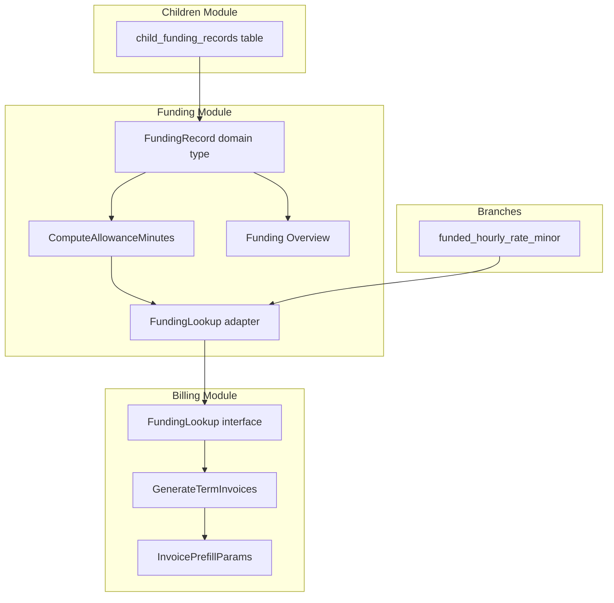

## Goal Capsule

**Objective:** Eliminate the per-month `funding_profiles` table. Make `child_funding_records` the sole source of truth for funding entitlement. The invoice engine computes funded allowance on the fly via a cross-module `FundingLookup` interface.

**Authority hierarchy:** This plan's decisions were resolved during a 28-question design interview. The plan is the authority for implementation.

**Stop conditions:**
- All existing billing tests pass with the new funding data flow
- Funding overview computes allowance without `funding_profiles`
- Invoice generation produces identical output for funded children
- `go vet ./...`, `go build ./...`, `npx ng lint` pass clean

**Execution profile:** Code implementation. Sequential units with dependency ordering.

**Tail ownership:** `ce-work` or `/goal` executor.

---

## Product Contract

### Summary

Refactor the funding model so `ChildFundingRecord` is the single source of truth for a child's funding entitlement. Eliminate the per-month `funding_profiles` denormalization table. The invoice engine fetches funding data via a new `FundingLookup` interface and computes allowance on the fly. Four funding types cover 80–90% of cases; EYPP/DAF deferred to a future phase.

### Problem Frame

Today the system maintains two funding representations: `child_funding_records` (registration-time entitlement) and `funding_profiles` (per-month denormalized snapshot). The billing pipeline reads exclusively from `funding_profiles`, requiring an explicit monthly upsert ceremony before invoicing. This creates data duplication, synchronization risk, and unnecessary operational overhead.

### Requirements

**Funding Source of Truth**

- R1. `ChildFundingRecord` is the sole source of truth for funding entitlement. The `funding_profiles` table is eliminated.
- R2. Four funding types: `universal_15`, `working_parent`, `working_parent_under_3`, `disadvantaged_2yo`. Plus `none` and `unknown`.
- R3. `FundingModel` enum preserved: `term_time_only`, `stretched`.
- R4. One active funding record per child. No concurrent records.
- R5. Manual eligibility code validation (checkbox). DfE API integration deferred.

**Allowance Computation**

- R6. Allowance computation lives in `funding/domain` as a shared service.
- R7. Term-time: `fundedHoursPerWeek × 60 × termDaysInMonth / 5` (existing formula).
- R8. Stretched: `fundedHoursPerWeek × 60 × 38 / 12` (fixed monthly allocation).
- R9. Pro-rate when funding starts/ends mid-month.
- R10. Proportional allocation across all booked sessions.

**Billing Integration**

- R11. Billing defines `FundingLookup` interface; funding module implements it.
- R12. `InvoicePrefillParams` carries both `SiteHourlyRateMinor` (private) and `FundedHourlyRateMinor` (branch-funded rate).
- R13. Funded hourly rate stored at branch level (`funded_hourly_rate_minor` on `branches`).
- R14. Funding applies to session fee only, not meals/snacks.
- R15. `AdvancePayTermRow` slimmed: remove funding fields. Invoice engine calls `FundingLookup` per child.

**User Interface**

- R16. Funding overview computes allowance from `ChildFundingRecord` + term dates (no `funding_profiles` dependency).
- R17. Remaining minutes: show full allowance before invoicing, subtract invoiced minutes after.
- R18. Funding changes after invoicing: manual regeneration with warning flag (no auto-invalidation).
- R19. Parent portal: full funding visibility via separate stripped-down endpoint.
- R20. Branch settings: editable funded hourly rate with zero-rate warning.
- R21. No funding record = fully private, zero deduction.

### Scope Boundaries

**Deferred to Follow-Up Work**

- EYPP and DAF supplementary funding (schema-ready with boolean fields, but logic deferred)
- DfE eligibility API integration (manual validation for now)
- Multiple concurrent funding records per child
- Auto-invalidation of drafts when funding changes

### Dependencies

- Branches table needs `funded_hourly_rate_minor` column
- `funding_profiles` table drop requires updating all SQL queries that join it
- `funding_isolation_test.go` must be updated to enforce the new invariant

---

## Planning Contract

### Key Technical Decisions

**KTD1. Funding module owns its own domain type.**
The funding module defines `FundingRecord` in `funding/domain/` rather than importing `ChildFundingRecord` from `children/domain/`. Both map to the same `child_funding_records` DB table. Follows Clean Architecture — each module owns its domain representation.
*Rationale:* Avoids cross-module domain imports. The funding module's `FundingRecord` can evolve independently.

**KTD2. `FundingLookup` is the cross-module boundary.**
Billing defines `FundingLookup` in its domain layer. The funding module provides an implementation wired via `bootstrap/adapters.go`. This follows the existing pattern (e.g., `TermDateLookup`, `ClosureDateLookup`).
*Rationale:* Billing never imports funding directly. The adapter pattern is proven in this codebase.

**KTD3. Remove funding fields from `AdvancePayTermRow`.**
Currently `AdvancePayTermRow` carries `FundingProfileID`, `FundedAllowanceMinutes`, `FundingModel`, `FundedHoursPerWeek` from a `LEFT JOIN funding_profiles`. After the refactor, these fields are removed and the invoice engine calls `FundingLookup.GetChildFunding()` per child.
*Rationale:* One extra DB call per child during invoice generation. For 50–200 children per branch, this is negligible. Keeps `AdvancePayTermRow` focused on term/booking data.

**KTD4. `funded_hourly_rate_minor` on branches table.**
The LA-funded hourly rate is a site-level config, not per-child. One nursery operates in one LA. Stored alongside existing `core_hourly_rate_minor`.
*Rationale:* Simpler than per-child rates. Matches reality.

**KTD5. Funding overview computes on read.**
No caching of computed allowance. The overview loads children + funding records + term dates, computes allowance per child, and returns results. Acceptable for typical branch sizes.
*Rationale:* Eliminates the monthly upsert ceremony. The computation is cheap (pure math, no external calls).

### Assumptions

- The `child_funding_records` table schema is sufficient for the new model (no new columns needed beyond the enum rename)
- The `branches` table currently has `core_hourly_rate_minor` — `funded_hourly_rate_minor` follows the same pattern
- The existing `CalculateTermTimeFundedAllowanceMinutes` function in `billing/domain` can be moved to `funding/domain` without breaking other consumers
- The `funding_isolation_test.go` can be updated to enforce the new invariant (billing reads via `FundingLookup`, not directly from `child_funding_records`)

### High-Level Technical Design



**Data flow for invoice generation:**
1. `GenerateTermInvoices` iterates active terms
2. For each child, calls `FundingLookup.GetChildFunding(ctx, tenantID, branchID, childID, billingMonth)`
3. Adapter loads `FundingRecord` from `child_funding_records`, loads `funded_hourly_rate_minor` from branch config
4. Calls `ComputeAllowanceMinutes` (term-time or stretched, with pro-rating)
5. Returns `FundedChildInfo` with computed allowance and funded rate
6. Invoice engine uses this to compute funded deduction

---

## Implementation Units

### U1. Database Schema: Funded Rate on Branches

**Goal:** Add `funded_hourly_rate_minor` column to the `branches` table.

**Requirements:** R13

**Dependencies:** None (first unit)

**Files:**
- `api/db/migrations/` — new migration: `000004_add_funded_hourly_rate_to_branches.{up,down}.sql`

**Approach:**
- Add `funded_hourly_rate_minor INTEGER NOT NULL DEFAULT 0` to `branches`
- Down migration drops the column

**Test scenarios:**
- Migration applies cleanly on a database with existing branches
- Down migration removes the column cleanly
- Existing branches get default value 0

**Verification:** `make migrate-verify` passes.

---

### U2. Database Schema: Rename Funding Type Enums

**Goal:** Rename `FundingType` enum values in the database and add EYPP/DAF boolean columns.

**Requirements:** R2

**Dependencies:** U1

**Files:**
- `api/db/migrations/` — new migration: `000005_rename_funding_types.{up,down}.sql`

**Approach:**
- Update CHECK constraints on `child_funding_records`, `child_funding_history`, and `bookings` tables
- Data migration: `UPDATE child_funding_records SET funding_type = CASE ... END`
- Mapping: `fifteen_hours` → `universal_15`, `thirty_hours` → `working_parent`, `two_year_old` → `disadvantaged_2yo`
- Add `eypp_eligible BOOL NOT NULL DEFAULT false` and `daf_eligible BOOL NOT NULL DEFAULT false` to `child_funding_records` (schema-ready for future)
- Down migration reverses the enum rename

**Test scenarios:**
- Migration renames existing data correctly
- CHECK constraints accept new values and reject old ones
- Down migration restores original enum values and data

**Verification:** `make migrate-verify` passes.

---

### U3. Database Schema: Drop Funding Profiles

**Goal:** Remove the `funding_profiles` table and all related SQL queries.

**Requirements:** R1

**Dependencies:** U6 (billing SQL must be updated first), U7 (GenerateTermInvoices must use FundingLookup first)

**Files:**
- `api/db/migrations/` — new migration: `000006_drop_funding_profiles.{up,down}.sql`
- `api/db/query/funding.sql` — remove `FundingProfile*` queries

**Approach:**
- Drop `funding_profiles` table in migration
- Remove all `FundingProfileGet`, `FundingProfileCreate`, `FundingProfileUpdateAllowance`, `FundingProfileGetForUpdate` queries from `api/db/query/funding.sql`
- Remove overview queries that `LEFT JOIN funding_profiles` (replaced in U10)
- Run `make sqlc-generate`

**Test scenarios:**
- Migration drops the table cleanly
- Down migration recreates the table (for rollback safety)
- All remaining SQL queries compile without references to `funding_profiles`

**Verification:** `make sqlc-generate` succeeds. `go build ./...` in `api/` passes.

---

### U4. Funding Domain: FundingRecord Type

**Goal:** Create the funding module's own `FundingRecord` domain type.

**Requirements:** R1, KTD1

**Dependencies:** None

**Files:**
- `api/internal/modules/funding/domain/funding_record.go` — **new**
- `api/internal/modules/funding/domain/repository.go` — add `FundingRecordRepository` interface

**Approach:**
- `FundingRecord` struct mirrors `ChildFundingRecord` fields: `ID`, `TenantID`, `BranchID`, `ChildID`, `FundingEnabled`, `FundingType`, `FundingModel`, `FundedHoursPerWeek`, `FundingStartDate`, `FundingEndDate`, `EligibilityCode`, `EligibilityCodeValidated`, `EvidenceReceived`, `BenefitsStatus`, benefit flags, `CreatedAt`, `UpdatedAt`
- Repository interface: `GetFundingRecord(ctx, tenantID, branchID, childID) (FundingRecord, bool, error)`, `UpsertFundingRecord(ctx, tx, record) (FundingRecord, error)`
- Reuse existing `FundingType`, `FundingModel` enums from `children/domain` or define parallel ones in `funding/domain`

**Test scenarios:**
- `FundingRecord` struct compiles with all required fields
- Repository interface methods are defined

**Verification:** `go build ./...` in `api/` passes.

---

### U5. Funding Domain: Allowance Computation Service

**Goal:** Create `ComputeAllowanceMinutes` in `funding/domain` — the shared service for computing funded allowance.

**Requirements:** R6, R7, R8, R9

**Dependencies:** U4

**Files:**
- `api/internal/modules/funding/domain/allowance.go` — **new**
- `api/internal/modules/funding/domain/allowance_test.go` — **new**

**Approach:**
- `ComputeAllowanceMinutes(fundedHoursPerWeek float64, fundingModel FundingModel, termDates []TermDateRange, billingMonth time.Time, closureDates []time.Time, fundingStartDate, fundingEndDate *time.Time) (int, error)`
- Term-time branch: reuse `CalculateTermTimeFundedAllowanceMinutes` logic (move from `billing/domain` or call via interface)
- Stretched branch: `fundedHoursPerWeek × 60 × 38 / 12`
- Pro-rating: restrict date range to `[max(fundingStartDate, billingMonthStart), min(fundingEndDate, billingMonthEnd)]`
- Zero hours or disabled funding returns 0

**Test scenarios:**
- Term-time: 15h/week, 20 term days in month → 15 × 60 × 20 / 5 = 3600 minutes
- Stretched: 15h/week → 15 × 60 × 38 / 12 = 2850 minutes
- Pro-rating: funding starts Jan 15, month has 22 weekdays → pro-rate from 15th
- Zero hours returns 0
- Disabled funding returns 0
- Edge case: funding ends before billing month → 0

**Verification:** `go test ./api/internal/modules/funding/domain/...` passes.

---

### U6. Billing Domain: FundingLookup Interface

**Goal:** Define the `FundingLookup` interface in the billing domain and update `InvoicePrefillParams`.

**Requirements:** R11, R12, R15

**Dependencies:** U5

**Files:**
- `api/internal/modules/billing/domain/funding_lookup.go` — **new**
- `api/internal/modules/billing/domain/services.go` — update `InvoicePrefillParams`
- `api/internal/modules/billing/domain/repository.go` — slim `AdvancePayTermRow`
- `api/internal/modules/billing/domain/funding_isolation_test.go` — update invariant

**Approach:**
- `FundingLookup` interface:
  ```go
  type FundingLookup interface {
      GetChildFunding(ctx context.Context, tenantID, branchID, childID uuid.UUID, billingMonth time.Time) (FundedChildInfo, error)
  }
  ```
- `FundedChildInfo` DTO: `HasFunding bool`, `FundingType string`, `FundedAllowanceMinutes int`, `FundedHourlyRateMinor int`, `FundedHoursPerWeek float64`
- `InvoicePrefillParams` changes: replace `HasFundingProfile bool` with `HasFunding bool`, replace `FundedAllowance int` with `FundedAllowanceMinutes int`, add `FundedHourlyRateMinor int`
- `AdvancePayTermRow`: remove `FundingProfileID`, `FundedAllowanceMinutes`, `FundingModel`, `FundedHoursPerWeek`
- Update `funding_isolation_test.go`: enforce new invariant (billing references `FundingLookup` interface, not `child_funding_records` directly)

**Test scenarios:**
- `FundedChildInfo` struct compiles
- `InvoicePrefillParams` has both rate fields
- `AdvancePayTermRow` has no funding fields
- Isolation test passes with new invariant

**Verification:** `go build ./...` in `api/` passes. `go test ./api/internal/modules/billing/domain/...` passes.

---

### U7. Billing Application: GenerateTermInvoices with FundingLookup

**Goal:** Update `GenerateTermInvoices` to call `FundingLookup` per child instead of reading from `AdvancePayTermRow` funding fields.

**Requirements:** R11, R15

**Dependencies:** U5, U6

**Files:**
- `api/internal/modules/billing/application/generate_term_invoices.go` — add `fundingLookup` dependency, update `Execute`
- `api/internal/modules/billing/application/generate_term_invoices_test.go` — update tests
- `api/internal/modules/billing/application/preflight_draft_invoices.go` — update if it reads funding from term row
- `api/internal/modules/billing/domain/preflight.go` — update `EligibleChild` if it has funding fields

**Approach:**
- Add `fundingLookup domain.FundingLookup` to `GenerateTermInvoices` struct
- In `Execute`: after loading term row, call `fundingLookup.GetChildFunding(ctx, tenantID, branchID, childID, billingMonth)`
- Use `FundedChildInfo.FundedAllowanceMinutes` instead of `termRow.FundedAllowanceMinutes`
- Use `FundedChildInfo.FundedHourlyRateMinor` for funded deduction calculation
- Use `FundedChildInfo.HasFunding` to decide whether to apply deduction
- Update `NewGenerateTermInvoices` constructor to accept `fundingLookup`
- Update `ComputeInvoicePrefill` call to pass new params

**Test scenarios:**
- Mock `FundingLookup` returns funded child → deduction applied
- Mock `FundingLookup` returns unfunded child → no deduction
- Mock `FundingLookup` returns child with funding mid-month → pro-rated allowance
- Existing invoice generation tests pass with mock funding lookup

**Verification:** `go test ./api/internal/modules/billing/application/...` passes.

---

### U8. Billing SQL: Remove funding_profiles Join

**Goal:** Update `BillingListActiveTermsForGeneration` SQL to remove the `LEFT JOIN funding_profiles`.

**Requirements:** R1, R15

**Dependencies:** U6 (AdvancePayTermRow must be slimmed first)

**Files:**
- `api/db/query/invoices.sql` — rewrite `BillingListActiveTermsForGeneration` query (lines 802–856)
- `api/internal/modules/billing/infrastructure/postgres/repository.go` — update `mapAdvancePayTermRows()`
- `api/internal/platform/db/sqlc/` — regenerated

**Approach:**
- Remove `LEFT JOIN funding_profiles fp` and all `fp.*` columns from the query
- Keep the `LEFT JOIN child_booking_patterns` for `term_time_only`
- Update `mapAdvancePayTermRows()` to stop mapping funding profile fields
- Run `make sqlc-generate`

**Test scenarios:**
- Query returns correct data without funding_profiles join
- `AdvancePayTermRow` populated correctly (no funding fields)
- Existing billing repository tests pass

**Verification:** `make sqlc-generate` succeeds. `go test ./api/internal/modules/billing/...` passes.

---

### U9. Bootstrap Wiring: FundingLookup Adapter

**Goal:** Create the adapter that implements `FundingLookup` and wire it into the DI container.

**Requirements:** R11, KTD2

**Dependencies:** U4, U5, U6

**Files:**
- `api/internal/app/bootstrap/adapters.go` — new `fundingLookupAdapter`
- `api/internal/app/bootstrap/wire.go` — new `wire.Bind` for `FundingLookup`
- `api/internal/app/bootstrap/wire_gen.go` — regenerated

**Approach:**
- `fundingLookupAdapter` struct wraps the funding repository and branch config
- `GetChildFunding` method: loads `FundingRecord` from funding repo, loads `funded_hourly_rate_minor` from branch config, calls `ComputeAllowanceMinutes`, returns `FundedChildInfo`
- Wire binds `fundingLookupAdapter` to `billingdomain.FundingLookup` in the billing set
- Follow existing patterns: `termDateLookupAdapter`, `closureDateLookupAdapter`

**Test scenarios:**
- Adapter compiles and implements `FundingLookup`
- Wire generates without errors

**Verification:** `go build ./...` in `api/` passes.

---

### U10. Funding Module: Remove FundingProfile, Add FundingRecord CRUD

**Goal:** Eliminate `FundingProfile` use cases and repository. Create new `FundingRecord` use cases.

**Requirements:** R1, R4

**Dependencies:** U4, U5, U3 (can run in parallel with U3 after U4/U5)

**Files:**
- `api/internal/modules/funding/application/upsert_profile.go` — **remove**
- `api/internal/modules/funding/application/get_profile.go` — **remove**
- `api/internal/modules/funding/application/get_child_funding.go` — **new**
- `api/internal/modules/funding/application/update_child_funding.go` — **new**
- `api/internal/modules/funding/domain/profile.go` — remove `FundingProfile` struct, keep `OverviewRow`/`OverviewResult`
- `api/internal/modules/funding/domain/repository.go` — replace `Repository` (profile CRUD) with `FundingRecordRepository`
- `api/internal/modules/funding/infrastructure/postgres/repository.go` — rewrite to use `child_funding_records` table

**Approach:**
- `GetChildFunding` use case: loads `FundingRecord`, calls `ComputeAllowanceMinutes`, returns record + computed allowance
- `UpdateChildFunding` use case: upserts `FundingRecord`, writes audit, writes funding history
- Repository maps to/from `child_funding_records` table (reuse existing sqlc queries from `child_funding_records.sql`)
- Remove all `funding_profiles`-related sqlc queries

**Test scenarios:**
- `GetChildFunding` returns record with computed allowance
- `UpdateChildFunding` creates/updates record and writes history
- Unfunded child returns `HasFunding: false`
- Existing funding tests updated to use new types

**Verification:** `go test ./api/internal/modules/funding/application/...` passes.

---

### U11. Funding Module: Rewrite Overview Queries

**Goal:** Update funding overview to compute allowance from `ChildFundingRecord` + term dates instead of joining `funding_profiles`.

**Requirements:** R16, R17

**Dependencies:** U5, U10

**Files:**
- `api/internal/modules/funding/application/list_overview.go` — rewrite
- `api/internal/modules/funding/application/get_enhanced_overview.go` — rewrite
- `api/internal/modules/funding/application/get_enhanced_child_detail.go` — rewrite
- `api/db/query/funding.sql` — rewrite overview queries (remove `LEFT JOIN funding_profiles`)

**Approach:**
- Overview loads all active children + their `FundingRecord` (batch query)
- Loads term dates for the billing month
- Calls `ComputeAllowanceMinutes` per funded child
- Loads invoiced minutes from existing invoices (for remaining calculation)
- `remainingMinutes = computedAllowance - invoicedMinutes`
- Flags: `missing_profile` → no `FundingRecord` with `FundingEnabled=true`; `expired_eligibility` → `FundingEndDate` in past; `zero_rate` → branch `funded_hourly_rate_minor = 0`

**Test scenarios:**
- Funded child with 15h term-time: overview shows computed allowance
- Child with no funding record: flagged as "missing"
- Child with expired eligibility: flagged
- Branch with zero funded rate: flagged
- Remaining minutes correct after invoicing

**Verification:** `go test ./api/internal/modules/funding/application/...` passes.

---

### U12. Funding HTTP: Update Endpoints and DTOs

**Goal:** Update funding HTTP handler to use new use cases and DTOs.

**Requirements:** R16, R18, R19

**Dependencies:** U10, U11

**Files:**
- `api/internal/modules/funding/interfaces/http/handler.go` — update endpoints
- `api/internal/modules/funding/interfaces/http/dto.go` — new request/response DTOs

**Approach:**
- `PUT /funding/children/:childId` — upsert `FundingRecord` (new payload: funding_type, funding_model, funded_hours_per_week, funding_start_date, funding_end_date, eligibility_code, eligibility_code_validated, evidence_received, funding_enabled)
- `GET /funding/children/:childId` — return funding record + computed allowance
- `GET /funding/overview` — rewritten to compute from records
- `GET /funding/children/:childId/allocation` — keep as-is
- `GET /funding/children/:childId/history` — keep as-is
- Response includes computed `funded_allowance_minutes` for the current billing month

**Test scenarios:**
- PUT creates funding record with new fields
- GET returns record with computed allowance
- Overview returns correct flags and computed allowances

**Verification:** `go test ./api/internal/modules/funding/...` passes.

---

### U13. Parent Portal: Funding Endpoint

**Goal:** Add a parent-facing funding endpoint with stripped-down response.

**Requirements:** R19

**Dependencies:** U10

**Files:**
- `api/internal/modules/funding/interfaces/http/handler.go` — add parent endpoint
- `api/internal/modules/funding/interfaces/http/dto.go` — add `ParentFundingResponse`

**Approach:**
- `GET /parent-portal/children/:childId/funding`
- Response: funding type, hours/week, model, dates, eligibility code (masked), computed allowance, remaining minutes
- No `ManagerNotes`, `EvidenceReceived`, `BenefitNotes`
- Use existing `GetParentFundingBreakdown` as reference

**Test scenarios:**
- Parent sees funding type and allowance
- Eligibility code is masked
- Internal fields not exposed
- Unfunded child returns minimal response

**Verification:** Handler tests pass.

---

### U14. Frontend: Update Funding Models and API Service

**Goal:** Update TypeScript models and API service to match new backend contract.

**Requirements:** R16, R19

**Dependencies:** U12

**Files:**
- `web/src/app/features/staff/models/funding.models.ts` — replace `FundingProfileRecord` with `FundingRecord`
- `web/src/app/features/staff/data/staff-api.service.ts` — update API calls

**Approach:**
- New `FundingRecord` interface: `fundingEnabled`, `fundingType`, `fundingModel`, `fundedHoursPerWeek`, `fundingStartDate`, `fundingEndDate`, `eligibilityCode`, `eligibilityCodeValidated`, `evidenceReceived`, `fundedAllowanceMinutes`
- Replace `FundingProfileWritePayload` with new payload matching backend
- Update `getFundingProfile` → `getFundingRecord`
- Update `upsertFundingProfile` → `upsertFundingRecord`
- Add parent portal funding endpoint call

**Test scenarios:**
- Models compile
- API service methods call correct endpoints

**Verification:** `npx ng lint` passes. `ng build` (production) passes.

---

### U15. Frontend: Update Funding Edit Form

**Goal:** Update the funding edit form to use new fields.

**Requirements:** R2, R3, R5

**Dependencies:** U14

**Files:**
- `web/src/app/features/staff/pages/` — funding edit component (find via glob)

**Approach:**
- Replace monthly allowance field with: funding type dropdown (universal_15, working_parent, working_parent_under_3, disadvantaged_2yo, none), hours/week input, funding model toggle (term_time_only / stretched), date pickers, eligibility code input, validated checkbox
- Display computed allowance read-only
- Add EYPP/DAF boolean toggles (disabled/hidden for now, schema-ready)

**Test scenarios:**
- Form submits new payload correctly
- Computed allowance displays after save
- Dropdown shows correct funding type options

**Verification:** `ng build` passes.

---

### U16. Frontend: Update Funding Overview Page

**Goal:** Update the funding overview to display computed data.

**Requirements:** R16, R17, R18, R20

**Dependencies:** U14

**Files:**
- `web/src/app/features/staff/pages/` — funding overview component (find via glob)

**Approach:**
- Display computed allowance from backend (not stored per-month)
- Show flags: missing funding, expired eligibility, zero-rate branch
- Show remaining minutes (full before invoicing, subtracted after)
- Warning when funding changed after invoice generation

**Test scenarios:**
- Overview shows computed allowance per child
- Flags render correctly
- Zero-rate warning appears when applicable

**Verification:** `ng build` passes.

---

### U17. Frontend: Parent Portal Funding View

**Goal:** Create parent-facing funding view.

**Requirements:** R19

**Dependencies:** U13, U14

**Files:**
- `web/src/app/features/parent-portal/pages/` — new parent funding component

**Approach:**
- Shows: funding type, hours/week, dates, computed allowance, remaining hours
- Read-only view, no editing
- Calls parent portal funding endpoint

**Test scenarios:**
- Parent sees child's funding status
- Unfunded child shows "No funding" message

**Verification:** `ng build` passes.

---

### U18. Tests: Update Existing and Add New

**Goal:** Ensure all existing tests pass and new tests cover the refactored code.

**Requirements:** All

**Dependencies:** U7, U10, U11

**Files:**
- `api/internal/modules/billing/application/compute_invoice_prefill_test.go` — update for new params
- `api/internal/modules/billing/application/generate_term_invoices_test.go` — add FundingLookup mock
- `api/internal/modules/funding/application/get_profile_test.go` — rewrite for new use case
- `api/internal/modules/funding/application/list_overview_test.go` — rewrite for new computation
- `api/internal/modules/funding/infrastructure/postgres/repository_test.go` — rewrite for FundingRecord
- `api/internal/modules/funding/domain/allowance_test.go` — **new** (covered in U5)

**Approach:**
- Update stub repos to match new interfaces
- Add `FundingLookup` mock for billing tests
- Update funding overview tests to verify computed allowances
- Verify `funding_isolation_test.go` enforces new invariant

**Test scenarios:**
- All existing billing tests pass with mocked `FundingLookup`
- Funding overview tests verify computed allowances
- Isolation test enforces new boundary

**Verification:** `go test ./api/...` passes. `npm test` in `web/` passes.

---

### U19. Domain Vocabulary: Update CONCEPTS.md

**Goal:** Update CONCEPTS.md to reflect the new funding model.

**Requirements:** R1

**Dependencies:** U1 (schema changes finalized)

**Files:**
- `CONCEPTS.md` — update funding entries

**Approach:**
- Update "Funding Record" entry: `ChildFundingRecord` is sole source of truth
- Update "Funded Allowance Minutes": computed on read from `ChildFundingRecord` + term dates, not stored per-month
- Remove references to `funding_profiles` table
- Add "Funded Hourly Rate" entry: branch-level LA rate for funded deductions

**Test scenarios:** N/A — documentation only

**Verification:** File reads correctly, no stale references to `funding_profiles`.

---

## Verification Contract

**Go static analysis:**
```
cd api && go fmt ./... && go vet ./... && go build ./...
```

**Go tests:**
```
cd api && go test ./...
```

**Repository integration tests (requires TEST_DATABASE_URL):**
```
make test-api-repositories
```

**Migration verification:**
```
make migrate-verify
```

**SQLC regeneration:**
```
make sqlc-generate
```

**Angular lint and build:**
```
cd web && npx ng lint && ng build
```

**Frontend tests:**
```
cd web && npm test
```

**Funding isolation test:**
```
cd api && go test ./internal/modules/billing/domain/ -run TestFundingIsolation
```

---

## Definition of Done

- [ ] `funding_profiles` table dropped
- [ ] `child_funding_records` is the sole funding source of truth
- [ ] `FundingLookup` interface defined in billing, implemented in funding
- [ ] `GenerateTermInvoices` uses `FundingLookup` per child
- [ ] `AdvancePayTermRow` has no funding fields
- [ ] Funding overview computes allowance from records + term dates
- [ ] `funded_hourly_rate_minor` on branches table
- [ ] Funding type enums renamed
- [ ] Parent portal funding endpoint works
- [ ] All Go tests pass (`go test ./...`)
- [ ] All Angular tests pass (`npm test`)
- [ ] Angular production build succeeds (`ng build`)
- [ ] `go vet ./...` clean
- [ ] `npx ng lint` clean
- [ ] Migration round-trip passes (`make migrate-verify`)
- [ ] `CONCEPTS.md` updated
- [ ] No dead code from removed `FundingProfile` types
