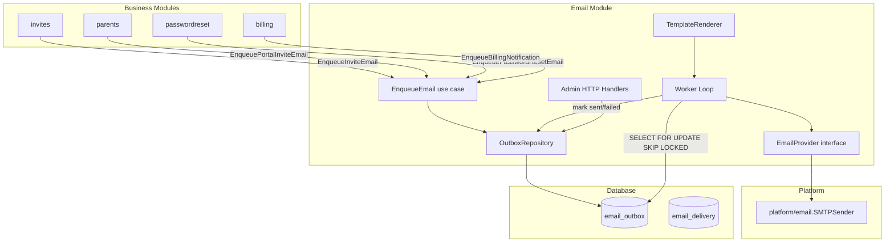
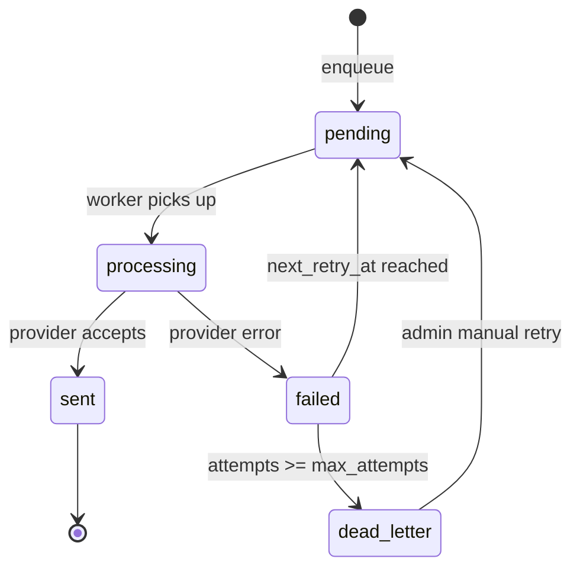

## Goal Capsule

**Objective:** Replace synchronous email sending with a resilient outbox-based async system. Business transactions must never depend on email delivery.

**Authority:** PRD at `docs/prds/email-sending-prd.md` defines the architectural principles. Project conventions in `AGENTS.md` and `docs/agents/ARCHITECTURE.md` govern code structure.

**Execution profile:** Single PR, big-bang migration of all 5 email flows. Implementation follows Clean Architecture module pattern with sqlc, Google Wire, and Gin.

**Stop conditions:**
- All 5 email flows write to outbox instead of sending synchronously
- Background worker drains outbox with retry and dead-letter handling
- Admin endpoints provide queue visibility and manual retry
- `go vet`, `go build`, `go fmt` pass; existing tests pass

**Tail ownership:** Email module owns ongoing maintenance. Platform/email remains the low-level SMTP provider.

## Product Contract

### Summary

The nursery management system currently sends emails synchronously inside HTTP requests. If SMTP is down, the business operation fails or the user gets no feedback. This plan introduces an outbox pattern: business modules insert email requests into an `email_outbox` table within their existing database transaction, and a background worker polls, sends, retries, and dead-letters failed emails.

### Problem Frame

Five email flows send synchronously via `platform/email.SMTPSender`:
1. Manager invite (`invites` module)
2. Parent portal invite (`parents` module)
3. Password reset (`passwordreset` module)
4. Invite accept (`invites` module)
5. Billing notifications (4 sub-types via `billing` module events)

If the SMTP server is unreachable, the request fails or the email is silently lost. There is no retry, no dead-letter handling, no delivery tracking, and no admin visibility into email health.

### Requirements

**Email infrastructure**
- R1. The system uses an outbox pattern: email requests are inserted into `email_outbox` within the same database transaction as the business operation.
- R2. A background worker polls pending emails, sends them via SMTP, and marks them sent or failed.
- R3. Failed emails retry with exponential backoff: 5s, 30s, 2min, 10min, 1hr, 6hrs. After 8 attempts, status becomes `dead_letter`.
- R4. Idempotency keys prevent duplicate sends. Key format: `{entity_type}_{entity_id}_{attempt}`.
- R5. The worker respects a configurable rate limit (`EMAIL_RATE_PER_SECOND`, default 10).

**Provider abstraction**
- R6. An `EmailProvider` interface abstracts the send mechanism. SMTP is the initial implementation. The platform layer (`platform/email/`) is wrapped, not replaced.
- R7. The `email_delivery` table and webhook endpoint are created as stubs for future provider webhook integration.

**Templates**
- R8. Email templates use Go `html/template` + `text/template`, embedded via `//go:embed`.
- R9. Templates are versioned via filenames (`invite_v1.html`). No DB-backed template storage.
- R10. Billing notification templates move from `app/bootstrap/templates/` to `modules/email/templates/`.

**Admin and observability**
- R11. Admin endpoints expose outbox listing (with status filter), single detail, manual retry, delivery status, and queue stats.
- R12. The worker runs on every server instance, gated behind `EMAIL_WORKER_ENABLED=true`.

**Migration**
- R13. All 5 existing email flows switch from sync to outbox in a single change (big-bang migration).

### Scope Boundaries

**Deferred for later:**
- Postmark or other transactional provider implementation
- Webhook processing for delivery/bounce/complaint events
- Runtime-editable templates (DB-backed)
- Email open/click tracking

**Outside this product's identity:**
- Message broker integration (RabbitMQ, Kafka, SQS) — PostgreSQL outbox is sufficient
- Multi-provider failover — one provider at a time

### Dependencies

- `platform/email/` — existing SMTPSender, reused as-is
- `platform/ratelimit/` — fixed-window limiter exists but is not suitable for worker rate limiting; worker uses sleep-based throttling
- `robfig/cron/v3` — already in go.mod, used for scheduler pattern
- `sqlc` — used for outbox query generation

## Planning Contract

### Key Technical Decisions

**KTD1: New `email/` module, not extending `platform/email/`.**
The outbox, worker, templates, webhooks, and admin endpoints belong in a new `modules/email/` module following Clean Architecture. `platform/email/` remains the low-level SMTP provider that the module wraps. This preserves module boundaries and follows the existing 25-module convention.

**KTD2: Direct outbox writes, not event system.**
Each business module inserts into `email_outbox` within its own transaction (via a cross-module `EmailEnqueuer` interface wired in `adapters.go`). The existing in-memory `EventDispatcher` is not used for email enqueueing because it runs after TX commit — losing the outbox guarantee.

**KTD3: Worker runs on every instance with `FOR UPDATE SKIP LOCKED`.**
Unlike `invoicerun.Scheduler` (single owner via advisory lock), the email worker uses PostgreSQL's `SKIP LOCKED` for safe concurrent processing. More instances = faster queue drain. Gated behind `EMAIL_WORKER_ENABLED` config flag.

**KTD4: SMTP-only provider at launch with proper abstraction.**
Build the `EmailProvider` interface correctly so adding Postmark/SES later is ~50 lines. No new provider dependencies now.

**KTD5: Go `html/template` + file-based versioning.**
Reuse existing template approach from billing notifications. No DB-backed template storage. Templates versioned via filenames.

**KTD6: Big-bang migration of all 5 flows.**
Single PR switches all email flows from sync to outbox. Lower complexity than maintaining dual paths. The behavioral change (silent background failure) is acceptable given the admin retry UI and the PRD's core principle.

### High-Level Technical Design



### Sequencing

Units are ordered by dependency. U1-U4 are the foundation. U5-U8 build the working system. U9 migrates existing flows. U10 adds webhook stubs.

### Assumptions

- The SMTP server is local or network-reliable enough for the worker to send emails without long timeouts. If the SMTP provider has its own rate limits, `EMAIL_RATE_PER_SECOND` should be configured below that threshold.
- Email template content is finalized at deploy time. No runtime editing needed.
- The admin endpoints require owner or manager authentication (reuse existing auth middleware).

## Implementation Units

### U1. Config additions

**Goal:** Add all email module configuration variables.

**Requirements:** R5, R12

**Files:**
- `api/internal/platform/config/config.go`

**Approach:** Add new config fields to the existing config struct: `EmailWorkerEnabled` (bool, default true), `EmailWorkerPollIntervalSeconds` (int, default 5), `EmailWorkerBatchSize` (int, default 100), `EmailRatePerSecond` (float64, default 10), `EmailRetryBackoffSeconds` ([]int, default `[5,30,120,600,3600,21600]`), `EmailMaxAttempts` (int, default 8). Parse from env vars `EMAIL_WORKER_ENABLED`, `EMAIL_WORKER_POLL_INTERVAL_SECONDS`, etc. Validate ranges on load.

**Test scenarios:**
- Config loads with defaults when env vars are absent
- Config rejects invalid values (negative rate, zero batch size, empty backoff array)
- Config parses custom backoff array from comma-separated env var

**Verification:** `go build ./...` in `api/`.

---

### U2. Database migration and sqlc queries

**Goal:** Create the `email_outbox` and `email_delivery` tables, generate sqlc code.

**Requirements:** R1, R3, R4, R7

**Files:**
- `api/db/migrations/000003_add_email_outbox.up.sql`
- `api/db/migrations/000003_add_email_outbox.down.sql`
- `api/db/query/email_outbox.sql`
- `api/db/query/email_delivery.sql`
- `api/internal/platform/db/sqlc/` (generated files)

**Approach:** Create migration with:

```sql
CREATE TABLE email_outbox (
    id UUID PRIMARY KEY DEFAULT gen_random_uuid(),
    tenant_id UUID NOT NULL,
    branch_id UUID NOT NULL,
    idempotency_key TEXT NOT NULL,
    event_type TEXT NOT NULL,
    recipient TEXT NOT NULL,
    recipient_name TEXT,
    subject TEXT NOT NULL,
    template_name TEXT NOT NULL,
    template_version INT NOT NULL DEFAULT 1,
    payload_json JSONB NOT NULL,
    status TEXT NOT NULL DEFAULT 'pending',
    attempts INT NOT NULL DEFAULT 0,
    max_attempts INT NOT NULL DEFAULT 8,
    next_retry_at TIMESTAMPTZ NOT NULL DEFAULT now(),
    last_error TEXT,
    provider_message_id TEXT,
    created_at TIMESTAMPTZ NOT NULL DEFAULT now(),
    sent_at TIMESTAMPTZ,
    CONSTRAINT email_outbox_status_check CHECK (status IN ('pending','processing','sent','failed','dead_letter')),
    CONSTRAINT email_outbox_unique_idempotency UNIQUE (tenant_id, branch_id, idempotency_key)
);

CREATE TABLE email_delivery (
    id UUID PRIMARY KEY DEFAULT gen_random_uuid(),
    provider_message_id TEXT NOT NULL,
    email_outbox_id UUID NOT NULL REFERENCES email_outbox(id),
    status TEXT NOT NULL,
    response_json JSONB,
    created_at TIMESTAMPTZ NOT NULL DEFAULT now()
);

CREATE INDEX idx_email_outbox_pending ON email_outbox (status, next_retry_at) WHERE status = 'pending';
CREATE INDEX idx_email_outbox_tenant ON email_outbox (tenant_id, branch_id);
CREATE INDEX idx_email_delivery_provider_msg ON email_delivery (provider_message_id);
```

Write sqlc queries: `GetPendingEmails` (SELECT FOR UPDATE SKIP LOCKED), `UpdateEmailStatus`, `GetEmailByID`, `ListEmails` (with status filter + pagination), `InsertEmail`, `GetEmailStats`, `InsertDeliveryEvent`, `GetDeliveryByProviderMessageID`.

Run `make sqlc-generate`.

**Test scenarios:**
- Migration applies cleanly on empty DB
- Migration rolls back cleanly
- Down migration drops both tables and indexes
- `GetPendingEmails` returns only pending rows with `next_retry_at <= now()`
- `GetPendingEmails` with SKIP LOCKED skips locked rows
- Unique constraint on `(tenant_id, branch_id, idempotency_key)` prevents duplicates

**Verification:** `make sqlc-generate` succeeds. Migration applies and rolls back.

---

### U3. Domain layer

**Goal:** Define domain entities, repository interfaces, and provider interface for the email module.

**Requirements:** R1, R4, R6

**Files:**
- `api/internal/modules/email/domain/outbox.go`
- `api/internal/modules/email/domain/delivery.go`
- `api/internal/modules/email/domain/provider.go`
- `api/internal/modules/email/domain/repository.go`
- `api/internal/modules/email/domain/events.go`

**Approach:** Define `OutboxMessage` struct (id, tenantID, branchID, idempotencyKey, eventType, recipient, recipientName, subject, templateName, templateVersion, payload, status, attempts, maxAttempts, nextRetryAt, lastError, providerMessageID, createdAt, sentAt). Define `Status` enum constants (Pending, Processing, Sent, Failed, DeadLetter). Define `DeliveryRecord` struct. Define `EmailProvider` interface with `Send(ctx, msg) (providerMessageID, error)`. Define `OutboxRepository` interface with `Insert`, `GetPending`, `UpdateStatus`, `GetByID`, `List`, `GetStats`, `InsertDelivery`, `GetDeliveryByProviderMessageID`. Define `EmailEnqueuer` interface for cross-module consumption: `Enqueue(ctx, tenantID, branchID, params) error`. All types zero-import — only `context`, `time`, and standard library.

**Test scenarios:**
- Status constants match expected string values
- `OutboxMessage` struct fields are accessible
- `EmailProvider` interface is satisfiable by a mock

**Verification:** `go vet ./internal/modules/email/...`

---

### U4. Application layer

**Goal:** Implement use cases for enqueueing, sending, retrying, and querying emails.

**Requirements:** R1, R2, R3, R4, R5, R11

**Files:**
- `api/internal/modules/email/application/enqueue.go`
- `api/internal/modules/email/application/send_pending.go`
- `api/internal/modules/email/application/retry.go`
- `api/internal/modules/email/application/stats.go`
- `api/internal/modules/email/application/list.go`

**Approach:**

`EnqueueEmail` — takes tenant/branch, event type, recipient, subject, template name, payload. Generates idempotency key (`{eventType}_{payload.entityID}_{1}`). Calls `outboxRepo.Insert` within the caller's transaction context. Returns the outbox message ID.

`SendPendingEmails` — called by the worker. Calls `outboxRepo.GetPending` (with batch size). For each message: render template, call `emailProvider.Send`, update status to sent or failed. On failure, compute `next_retry_at` from backoff schedule based on `attempts`. If `attempts >= max_attempts`, set status to `dead_letter`. Respects rate limit via sleep between sends.

`RetryEmail` — resets a dead-letter email to `pending` with `next_retry_at = now()`.

`ListEmails` — delegates to repository with status filter and pagination.

`GetEmailStats` — returns counts by status.

**Test scenarios:**
- `EnqueueEmail` generates correct idempotency key
- `EnqueueEmail` inserts into outbox repository
- `SendPendingEmails` processes pending emails and marks sent on success
- `SendPendingEmails` marks failed and computes next_retry_at on provider error
- `SendPendingEmails` transitions to dead_letter after max attempts
- `SendPendingEmails` skips emails whose next_retry_at is in the future
- `SendPendingEmails` respects rate limit (sleeps between sends)
- `RetryEmail` resets dead_letter to pending
- Template rendering failure marks email as failed with error message

**Verification:** Unit tests with mock repository and mock provider.

---

### U5. Postgres repository

**Goal:** Implement `OutboxRepository` using sqlc-generated code.

**Requirements:** R1, R3

**Files:**
- `api/internal/modules/email/infrastructure/postgres/outbox_repo.go`
- `api/internal/modules/email/infrastructure/postgres/outbox_repo_test.go`

**Approach:** Implement the `OutboxRepository` interface using the sqlc queries from U2. Map between domain `OutboxMessage` and sqlc model. Use `txMgr.ExecTx` for operations that need transactions. The `GetPending` method uses `FOR UPDATE SKIP LOCKED` via the sqlc-generated query. Pagination via `LIMIT`/`OFFSET` with total count.

**Test scenarios:**
- Insert and retrieve an outbox message
- GetPending returns only pending rows with expired retry time
- UpdateStatus transitions between valid statuses
- GetStats returns correct counts grouped by status
- Duplicate idempotency_key insert fails with domain error

**Verification:** Integration tests against test database.

---

### U6. SMTP provider wrapper

**Goal:** Wrap `platform/email.SMTPSender` to satisfy the email module's `EmailProvider` interface.

**Requirements:** R6

**Files:**
- `api/internal/modules/email/infrastructure/smtp/provider.go`

**Approach:** Implement `EmailProvider` by delegating to `platform/email.SMTPSender.Send`. Map `domain.OutboxMessage` fields to `email.Message` struct. Return empty string for provider message ID (SMTP does not provide one). Return errors as-is.

**Test scenarios:**
- Successful send returns empty provider message ID
- SMTP error propagates as provider error
- Message fields map correctly (To, Subject, HTML, Text)

**Verification:** `go vet ./internal/modules/email/...`

---

### U7. Template system

**Goal:** Build template renderer, move billing templates to email module, add new templates.

**Requirements:** R8, R9, R10

**Files:**
- `api/internal/modules/email/application/renderer.go`
- `api/internal/modules/email/templates/issued.html`
- `api/internal/modules/email/templates/issued.txt`
- `api/internal/modules/email/templates/overdue.html`
- `api/internal/modules/email/templates/overdue.txt`
- `api/internal/modules/email/templates/due-soon.html`
- `api/internal/modules/email/templates/due-soon.txt`
- `api/internal/modules/email/templates/due-reminder.html`
- `api/internal/modules/email/templates/due-reminder.txt`
- `api/internal/modules/email/templates/invite.html`
- `api/internal/modules/email/templates/invite.txt`
- `api/internal/modules/email/templates/password_reset.html`
- `api/internal/modules/email/templates/password_reset.txt`
- `api/internal/modules/email/templates/portal_invite.html`
- `api/internal/modules/email/templates/portal_invite.txt`

**Approach:** Create `TemplateRenderer` that loads templates via `//go:embed templates/*`. Uses `html/template` for HTML body and `text/template` for text body. Template naming convention: `{name}_v{version}.html` / `{name}_v{version}.txt`. Renderer has `Render(templateName, version, data) (htmlBody, textBody, error)`. Move existing billing templates from `app/bootstrap/templates/` to `modules/email/templates/`. Create new templates for invite, password reset, and portal invite using the existing plain-text content as a starting point, wrapped in a simple HTML layout.

**Test scenarios:**
- Render existing billing templates with sample data produces valid HTML
- Render invite template with sample data
- Render password reset template with sample data
- Missing template returns error
- Template rendering with invalid data returns error

**Verification:** `go test ./internal/modules/email/...`

---

### U8. Worker scheduler

**Goal:** Build the background worker that polls and sends pending emails.

**Requirements:** R2, R3, R5, R12

**Files:**
- `api/internal/modules/email/scheduler.go`

**Approach:** Create `Scheduler` struct following `invoicerun.Scheduler` pattern. Not cron-based — uses `time.Ticker` with configurable interval. Each tick: call `SendPendingEmails` use case. Goroutine with context cancellation for graceful shutdown. Constructor takes config, outbox repository, email provider, template renderer. `Start(ctx)` and `Stop()` methods matching the existing scheduler interface. Logs via `slog`. Metrics via `metrics.Recorder.SchedulerRun`.

**Test scenarios:**
- Scheduler starts and polls on interval
- Scheduler stops cleanly on context cancellation
- Scheduler handles SendPendingEmails errors without crashing
- Multiple scheduler instances do not process the same row (SKIP LOCKED)

**Verification:** `go vet ./internal/modules/email/...`

---

### U9. Admin HTTP endpoints

**Goal:** Expose admin endpoints for email queue management.

**Requirements:** R11

**Files:**
- `api/internal/modules/email/interfaces/http/handler.go`
- `api/internal/modules/email/interfaces/http/routes.go`
- `api/internal/modules/email/interfaces/http/dto.go`

**Approach:** Implement Gin handlers for:
- `GET /api/v1/email/outbox` — list with `?status=pending|sent|failed|dead_letter`, pagination
- `GET /api/v1/email/outbox/:id` — single message detail
- `POST /api/v1/email/outbox/:id/retry` — reset dead_letter to pending
- `GET /api/v1/email/delivery/:provider_message_id` — delivery events
- `GET /api/v1/email/stats` — queue size counts by status

All endpoints behind owner/manager auth (use existing `tenant.ActorFromGinContext` pattern). Map domain errors via `MapDomainError`.

**Test scenarios:**
- List returns filtered results with pagination
- Get by ID returns 404 for nonexistent message
- Retry resets dead_letter message to pending
- Retry returns error for non-dead_letter message
- Stats returns correct counts
- Unauthenticated requests return 401

**Verification:** Handler tests with mock use cases.

---

### U10. Wire injection and main.go integration

**Goal:** Wire the email module into the application and start the worker.

**Requirements:** R12, R13

**Files:**
- `api/internal/app/bootstrap/adapters.go` (additions)
- `api/internal/app/bootstrap/providers.go` (additions)
- `api/internal/app/bootstrap/bootstrap.go` (additions)
- `api/internal/app/bootstrap/wire.go` (additions)
- `api/internal/app/bootstrap/wire_gen.go` (regenerated)
- `api/cmd/server/main.go` (additions)

**Approach:** Add `emailSet` to Wire with all email module providers. Add enqueue adapter structs in `adapters.go` for each consumer module:
- `emailEnqueuerAdapter` — wraps `email.EnqueueEmail` for cross-module use
- Each consumer module (invites, parents, passwordreset, billing/notifications) defines an `EmailEnqueuer` interface and receives the adapter

In `main.go`, after `bootstrap.InitializeApp()`, conditionally start the email scheduler:

```go
if cfg.Email.WorkerEnabled {
    go emailScheduler.Start(ctx)
}
```

Register email routes in `bootstrap.go`. Add graceful shutdown for the scheduler.

**Test scenarios:**
- Application starts with email worker enabled
- Application starts with email worker disabled
- Email routes are registered and accessible
- Scheduler shuts down cleanly on SIGTERM

**Verification:** `go build ./...` succeeds. `make run-api` starts without errors.

---

### U11. Cross-module migration — billing notifications

**Goal:** Switch billing notification emails from sync (via event handlers) to outbox inserts.

**Requirements:** R1, R13

**Files:**
- `api/internal/modules/notifications/application/` (modify handlers)
- `api/internal/app/bootstrap/adapters.go` (modify billing notification adapter)

**Approach:** The billing notification handlers currently call `billingNotificationAdapter.SendXxxEmail()` which sends synchronously. Replace with calls to the email module's `EnqueueEmail` use case. Each of the 4 notification types (issued, overdue, due-soon, due-reminder) maps to an event type and template name. The adapter in `adapters.go` changes from implementing `SendInvoiceIssuedEmail(ctx, ...)` to `EnqueueInvoiceIssuedEmail(ctx, ...)` — inserting an outbox row instead of sending directly.

The existing `EventDispatcher` registration stays — handlers still fire on domain events, but they enqueue instead of send.

**Test scenarios:**
- InvoiceIssued event inserts outbox row with correct template and payload
- InvoiceMarkedOverdue event inserts outbox row per invoice
- InvoiceDueSoon event inserts outbox row
- InvoiceDueReminder event inserts outbox row
- Outbox insert failure rolls back the notification (logged, not retried)

**Verification:** Existing notification handler tests pass with mock enqueuer.

---

### U12. Cross-module migration — invites, password reset, portal invite

**Goal:** Switch invite and password reset emails from sync to outbox inserts.

**Requirements:** R1, R13

**Files:**
- `api/internal/modules/invites/application/` (modify email adapter usage)
- `api/internal/modules/passwordreset/application/` (modify email adapter usage)
- `api/internal/modules/parents/application/` (modify portal invite flow)
- `api/internal/app/bootstrap/adapters.go` (modify email adapters)

**Approach:** Each module's email adapter currently implements a `SendXxxEmail` method that calls `sender.Send()` directly. Replace with outbox enqueue calls. The adapter pattern stays the same — only the implementation changes from "send now" to "insert outbox row". The `EmailEnqueuer` interface is defined in each consumer module's domain, wired to the email module in `adapters.go`.

For invites: `emailSenderAdapter.SendManagerInviteEmail` → `emailEnqueuerAdapter.Enqueue(ctx, tenantID, branchID, EnqueueParams{EventType: "manager_invite", ...})`

For password reset: `email_adapter.SendPasswordResetEmail` → enqueue with event type `password_reset`

For parent portal invite: `parentEmailSenderAdapter.SendPortalInviteEmail` → enqueue with event type `portal_invite`

**Test scenarios:**
- Manager invite creates outbox row with invite template
- Password reset creates outbox row with password_reset template
- Parent portal invite creates outbox row with portal_invite template
- All flows return success even if outbox insert succeeds (email delivery is async)
- Existing flow tests pass with mock enqueuer

**Verification:** `go test ./internal/modules/invites/... ./internal/modules/passwordreset/... ./internal/modules/parents/...`

---

### U13. Webhook stub endpoint

**Goal:** Create the webhook endpoint and delivery tracking schema for future provider integration.

**Requirements:** R7

**Files:**
- `api/internal/modules/email/interfaces/http/webhook_handler.go`

**Approach:** Add `POST /api/v1/email/webhooks/postmark` route. Handler parses the webhook payload, inserts into `email_delivery` table, and updates the corresponding `email_outbox.provider_message_id`. For now, the handler accepts the payload but logs a warning: "Webhook received but no provider configured for delivery tracking". The route is registered so the URL is stable for provider configuration later.

**Test scenarios:**
- Webhook endpoint returns 200 for valid payload
- Webhook endpoint returns 400 for invalid payload
- Delivery record is inserted into database

**Verification:** `go vet ./internal/modules/email/...`

---

### U14. Remove old sync email code from adapters

**Goal:** Clean up the old synchronous email adapter implementations that are no longer used.

**Requirements:** R13

**Files:**
- `api/internal/app/bootstrap/adapters.go` (remove old adapter structs)

**Approach:** After U11 and U12 migrate all flows to outbox, remove the now-unused adapter structs:
- `emailSenderAdapter` (manager invite sync sender)
- `parentEmailSenderAdapter` (parent portal invite sync sender)
- `billingNotificationAdapter` (billing notification sync sender with HTML templates)

Keep `platform/email/` package intact — it is still the SMTP provider used by the email module.

**Test scenarios:**
- No compilation errors after removal
- No test references to removed adapters

**Verification:** `go build ./...` and `go vet ./...`

## Verification Contract

| Gate | Command | When |
|---|---|---|
| Static analysis | `go fmt ./...`, `go vet ./...`, `go build ./...` in `api/` | After every unit |
| sqlc generation | `make sqlc-generate` | After U2 |
| Module tests | `go test ./internal/modules/email/...` | After U4, U5, U7, U9 |
| Cross-module tests | `go test ./internal/modules/invites/... ./internal/modules/passwordreset/... ./internal/modules/parents/... ./internal/modules/notifications/...` | After U11, U12 |
| Full build | `go build ./...` | After U10, U14 |
| Frontend lint | `npx ng lint` in `web/` | N/A (no frontend changes) |

## Definition of Done

- All 14 implementation units complete
- `go fmt ./...`, `go vet ./...`, `go build ./...` pass in `api/`
- `make sqlc-generate` produces no diffs (generated code is committed)
- Existing tests pass: `go test ./...`
- Migration `000003_add_email_outbox` applies and rolls back cleanly
- Email worker starts and processes outbox rows in local testing
- Admin endpoints return correct data in local testing
- No direct `sender.Send()` calls remain in business modules (all go through outbox)
- PRD's core principle verified: business operations succeed even when SMTP is unreachable

## Appendix

### Config Variables Reference

| Variable | Type | Default | Description |
|---|---|---|---|
| `EMAIL_WORKER_ENABLED` | bool | `true` | Enable background email worker |
| `EMAIL_WORKER_POLL_INTERVAL_SECONDS` | int | `5` | How often worker polls for pending emails |
| `EMAIL_WORKER_BATCH_SIZE` | int | `100` | Max emails per poll batch |
| `EMAIL_RATE_PER_SECOND` | float64 | `10` | Send rate limit |
| `EMAIL_RETRY_BACKOFF_SECONDS` | []int | `5,30,120,600,3600,21600` | Backoff intervals between retries |
| `EMAIL_MAX_ATTEMPTS` | int | `8` | Attempts before dead letter |

### Outbox Status State Machine


