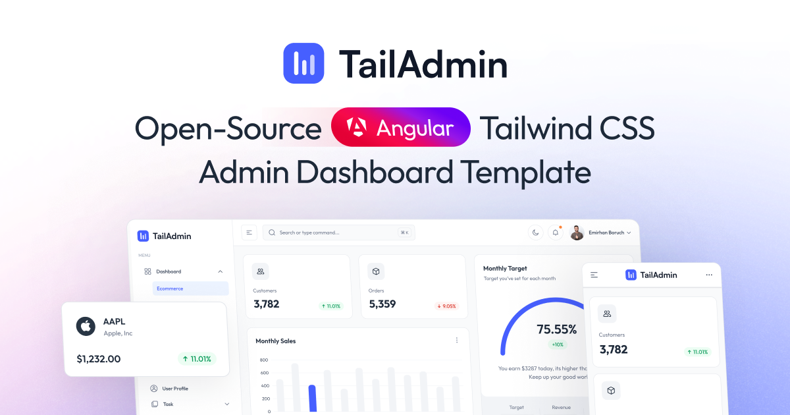

# Free Angular Tailwind Admin Dashboard Template - TailAdmin Angular

TailAdmin Angular is a **free and open-source admin dashboard template** built with **Angular** and **Tailwind CSS**. It provides developers with everything they need to create a feature-rich, data-driven **back-end, dashboard, or admin panel** for any type of web project.




With TailAdmin Angular, you’ll get access to a complete set of **dashboard UI components, elements, and ready-to-use pages** to build a modern, high-quality admin panel. Whether it’s for a **complex web application** or a **lightweight project**, TailAdmin Angular is designed to speed up development of any kind of dashboards and admin panels.

TailAdmin leverages the **powerful ecosystem of Angular 20+**, along with **TypeScript** and the utility-first styling of **Tailwind CSS v4**. Combined, they make TailAdmin Angular a perfect foundation to launch your dashboard or admin panel quickly and effectively.

TailAdmin Angular comes with essential UI components and layouts for building **feature-rich, data-driven dashboards** and **admin panels**. TailAdmin Angular is built on:

* **Angular 20+**
* **TypeScript**
* **Tailwind CSS v4**

### Quick Links

- ✨ [Visit Website](https://tailadmin.com/)
- 🚀 [Angular Demo](https://angular-demo.tailadmin.com/)
- 📄 [Documentation](https://tailadmin.com/docs)
- ⬇️ [Download](https://tailadmin.com/download)
- 🖌️ [Figma Design File (Free Edition)](https://www.figma.com/community/file/1463141366275764364)
- ⚡ [Get PRO Version](https://tailadmin.com/pricing)
---

## Feature Comparison

| Feature | Free Version | Pro Version 🌟 |
|---------|--------------|----------------|
| **Dashboards** | 1 Unique Dashboard | 7 Unique Dashboards: Analytics, Ecommerce, Marketing, SaaS, CRM, Stocks, Logistics and more (more coming soon) 📈 |
| **UI Elements and Components** | 100+ UI elements and components | Included in 500+ components and UI elements |
| **Design Files** | Basic Figma design files | Complete Figma design system file |
| **Support** | Community support| Email support |

### Other Versions

- [Next.js Version](https://github.com/TailAdmin/free-nextjs-admin-dashboard)
- [React.js Version](https://github.com/TailAdmin/free-react-tailwind-admin-dashboard)
- [Vue.js Version](https://github.com/TailAdmin/vue-tailwind-admin-dashboard)
- [Angular Version](https://github.com/TailAdmin/free-angular-tailwind-dashboard)
- [Laravel Version](https://github.com/TailAdmin/tailadmin-laravel)

## Installation

### Prerequisites

Before you start, make sure you have:

* **Node.js 20.x or later** (Node.js 20.x recommended)
* **Angular CLI** installed globally:

```bash
npm install -g @angular/cli
```

---

### Cloning the Repository

Clone the repository:

```bash
git clone https://github.com/TailAdmin/free-angular-admin-dashboard.git
```

---

### Install Dependencies

```bash
npm install
# or
yarn install
```

---

### Start Development Server

```bash
npm start
```

Then open:
👉 `http://localhost:4200`

---

## Angualr.js Tailwind Components

TailAdmin Angular ships with a rich set of **ready-to-use dashboard features**:

* **Ecommerce Dashboard** with essential elements
* Modern, accessible **sidebar navigation**
* **Data visualization** with charts and graphs
* **User profile management** and a **custom 404 page**
* **Tables** and **charts** (line, bar, etc.)
* **Authentication forms** and reusable input components
* **UI elements**: alerts, dropdowns, modals, buttons, and more
* Built-in **Dark Mode** 🕶️
* and many more


## Changelog

### Version 1.1.0 - [April 28, 2026]
- Added **AI Dashboard** with token usage and revenue tracking.
- Added **Sales Dashboard** with retention and multi-channel analytics.
- Added **Finance Dashboard** with cashflow and balance management.
- Introduced **6 New Layout variations** for improved UI flexibility.
- Integrated **Advanced Data Visualization** with 7+ new chart types.

### v1.0.3 (2026-03-15)

- **update**: update Angular dependencies to version 21.2.x.

### v1.0.2 (2025-12-30)

- **Upgrade**: Successfully upgraded project to **Angular 21**.
- **New Feature**: Implementing **Dynamic API Keys** management.
  - Added functionalities to **Add**, **Edit**, **Delete**, and **Regenerate** API Keys.
- **Enhancement**: Integrated **Flatpickr** date range picker in `StatisticsChartComponent`.
- **Bug Fix**: Resolved `NG0100` ExpressionChangedAfterItHasBeenCheckedError in `PieChartTwoComponent`.
- **Bug Fix**: Fixed `NG8113` warning in `AddApiKeyModalComponent` by removing unused imports.
- **Cleanup**: Removed unused imports and optimized code across various components.
